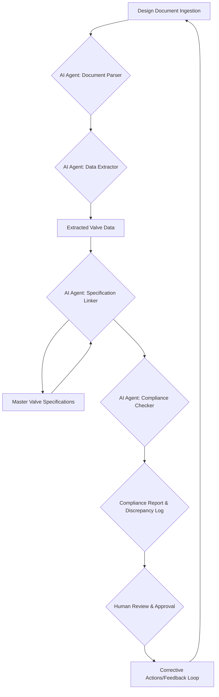

## Introduction: The Imperative of Specification Compliance in Engineering

In the complex world of engineering, especially within sectors like oil & gas, EPC (Engineering, Procurement, and Construction), and manufacturing, adherence to specifications is not merely a best practice—it's a critical foundation for project success, safety, and regulatory compliance. Every bolt, pipe, and circuit must meet stringent design codes, client requirements, and international standards. Manual compliance checks, however, are notoriously time-consuming, prone to human error, and a significant bottleneck in project timelines.

The traditional approach involves engineers painstakingly reviewing thousands of pages of technical documents, drawings, and data sheets against project specifications. This labor-intensive process often leads to:

*   **Delayed Project Schedules:** Rework due to missed compliance issues can push project deadlines back by weeks or even months.
*   **Increased Costs:** Manual reviews are expensive, and rectifying errors discovered late in the design cycle incurs substantial additional costs.
*   **Quality Inconsistencies:** Human fatigue and subjective interpretation can lead to variations in compliance levels across different parts of a project.
*   **Safety Risks:** Non-compliance, particularly in safety-critical systems, can result in catastrophic failures, environmental damage, and loss of life.

This is where agentic AI systems are stepping in, offering a transformative solution to automate and enhance specification compliance in engineering design. By leveraging autonomous AI agents, engineering firms can ensure rigorous adherence to standards, significantly reduce errors, and accelerate project delivery with unprecedented accuracy.

## What is Agentic AI and Why is it Critical for Compliance?

Agentic AI refers to intelligent systems composed of multiple autonomous agents that can perceive their environment, reason, plan, act, and learn to achieve specific goals. Unlike traditional AI tools that perform isolated tasks, agentic AI systems are designed for complex, multi-step workflows, coordinating different AI capabilities and data sources to achieve a larger objective.

For specification compliance, this means moving beyond simple keyword searches or rule-based checks. An agentic AI system can:

1.  **Understand Context:** Interpret engineering drawings, P&IDs (Piping and Instrumentation Diagrams), 3D models, and textual specifications with contextual understanding, not just pattern matching.
2.  **Reason and Infer:** Apply engineering logic to infer compliance status, identify potential conflicts, and even suggest corrective actions.
3.  **Self-Correct and Iterate:** Learn from feedback and new data, continuously improving its accuracy and efficiency over time.
4.  **Orchestrate Workflows:** Coordinate various AI modules (e.g., computer vision for drawing analysis, NLP for document understanding, knowledge graphs for standards lookup) to perform comprehensive compliance checks.

The "agentic" nature allows for a more dynamic and robust compliance framework. Instead of a single, monolithic AI attempting to do everything, specialized agents can focus on specific aspects of compliance, collaborating to ensure holistic adherence.

## Real-World Example: Automating Valve Specification Compliance in a Pipeline Project

Consider a large-scale pipeline project involving thousands of valves, each with specific requirements related to material, pressure rating, temperature limits, end connections, and actuator types. Manually verifying that every valve in the P&IDs, line lists, and procurement specifications matches the project's master valve specification document is a monumental task.

### The Traditional Workflow:

1.  **Manual Data Extraction:** Engineers manually read through P&IDs and line lists to identify each valve, its tag number, type, and associated parameters.
2.  **Specification Lookup:** Cross-reference extracted data against the project's master valve specification document (often a lengthy PDF or series of documents).
3.  **Discrepancy Identification:** Identify any mismatches between the design documents and the specification.
4.  **Rework and Iteration:** Log discrepancies, initiate change orders, and track corrections, leading to significant delays.

### The Agentic AI Workflow:

An agentic AI system can transform this process into an automated, continuous compliance loop. Here's a simplified workflow:

**Workflow Breakdown:**

1.  **Design Document Ingestion (A):** The system continuously ingests new or revised P&IDs, line lists, and 3D models as they are generated.
2.  **AI Agent: Document Parser (B):** A specialized agent uses advanced computer vision and NLP techniques to parse and understand the structure of the incoming documents.
3.  **AI Agent: Data Extractor (C):** This agent extracts key valve data (tag number, size, class, material, service, actuator type, etc.) from various sources, normalizing the data into a structured format.
4.  **Extracted Valve Data (D):** The standardized valve data is stored in a central knowledge base.
5.  **AI Agent: Specification Linker (E):** This agent intelligently links the extracted valve data to the relevant sections and parameters within the **Master Valve Specifications (F)**. It uses semantic understanding to bridge potential variations in terminology.
6.  **AI Agent: Compliance Checker (G):** The core compliance agent compares each extracted valve parameter against the linked specifications. It applies engineering rules and logical reasoning to flag non-compliances. For example:
    *   If a carbon steel valve is specified for corrosive service without a suitable lining, it's flagged.
    *   If a valve's pressure rating is below the line's maximum operating pressure, it's flagged.
    *   If the actuator type doesn't match the control philosophy.
7.  **Compliance Report & Discrepancy Log (H):** The system generates a detailed report outlining all compliance issues, complete with references to the specific location in the design documents and the violated specification clause.
8.  **Human Review & Approval (I):** Engineers review the AI-generated compliance report. The AI doesn't replace human oversight but augments it, allowing engineers to focus on critical decisions and complex exceptions.
9.  **Corrective Actions/Feedback Loop (J):** Discrepancies are addressed, and the corrective actions (e.g., updating a P&ID, revising a specification) feed back into the system for continuous monitoring. The agents also learn from approved corrections, refining their future compliance checks.

## Measurable Outcomes of Agentic AI for Compliance

The implementation of agentic AI for specification compliance yields significant, measurable benefits:

*   **Up to 70% Reduction in Manual Review Time:** By automating data extraction and cross-referencing, engineers can reallocate their time to higher-value tasks, dramatically accelerating design cycles.
*   **90% Improvement in Compliance Accuracy:** AI agents eliminate human error due to fatigue or oversight, ensuring a much higher level of adherence to specifications. This translates to fewer costly reworks in later project stages.
*   **Faster Project Delivery:** Reduced review times and fewer compliance issues mean projects can move from design to procurement and construction phases more quickly. For a typical EPC project, this could mean reducing the overall project schedule by 5-10%.
*   **Enhanced Risk Mitigation:** Proactive identification of non-compliance issues early in the design phase significantly reduces the risk of safety incidents, regulatory penalties, and operational failures.
*   **Improved Knowledge Management:** The structured data extracted and the rules learned by the AI agents contribute to a robust, searchable knowledge base, making future projects even more efficient.
*   **Cost Savings:** Lower labor costs for manual reviews, reduced rework expenses, and faster project completion directly contribute to substantial cost savings. For a project with a budget of $100 million, a 2% saving due to improved efficiency and reduced rework can translate to $2 million.

## Implementing Agentic AI for Your Engineering Firm

Adopting agentic AI for specification compliance requires a strategic approach:

1.  **Start Small, Scale Smart:** Begin with a pilot project focusing on a specific, high-impact area (like valve compliance or structural steel connection checks).
2.  **Data Readiness:** Ensure your engineering documents and specifications are digitized and, ideally, in machine-readable formats. Invest in data cleansing and normalization.
3.  **Integrate with Existing Systems:** The agentic AI platform should seamlessly integrate with your existing CAD, EDMS (Engineering Document Management System), and project management tools.
4.  **Human-in-the-Loop:** Design the workflow to keep engineers in control. The AI should serve as an intelligent assistant, not a replacement for expert judgment.
5.  **Continuous Learning and Feedback:** Establish mechanisms for the AI agents to learn from human feedback and adapt to evolving specifications and project requirements.

## Conclusion

Agentic AI for automated specification compliance is not a futuristic concept; it's a present-day reality transforming engineering design. By offloading the tedious, error-prone tasks of manual compliance checks to intelligent agents, engineering firms can unlock unprecedented levels of efficiency, accuracy, and project certainty. This empowers engineers to innovate, focus on complex problem-solving, and deliver projects that are not only compliant but also safer, more reliable, and delivered on time and within budget. Embrace agentic AI to future-proof your engineering workflows and gain a significant competitive advantage.

---
**Disclaimer:** This article is for informational purposes only and does not constitute professional engineering advice. Consult with qualified professionals for specific project requirements.
