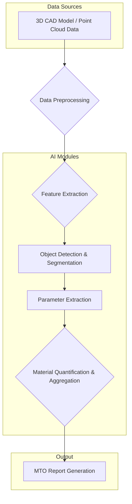

## Introduction: The Challenge of Traditional Material Take-Off (MTO)

In large-scale engineering projects, particularly in sectors like oil & gas, infrastructure, and manufacturing, Material Take-Off (MTO) is a critical, yet often cumbersome, process. MTO involves identifying and quantifying all necessary materials from engineering drawings, specifications, and 3D models to support procurement, construction planning, and cost estimation.

Traditional MTO methods are notoriously labor-intensive, error-prone, and time-consuming. Engineers and quantity surveyors manually sift through thousands of P&IDs, isometric drawings, general arrangement drawings, and vendor documents. This manual process is susceptible to human error, leading to:

*   **Cost overruns:** Inaccurate quantities can result in expensive material shortages or costly over-procurement.
*   **Project delays:** Manual data extraction and reconciliation consume significant project time, impacting schedules.
*   **Rework:** Errors in MTO propagate downstream, causing rework during fabrication and construction.
*   **Reduced competitive advantage:** Slow and inefficient MTO processes hinder rapid bidding and project execution.

The advent of digital engineering, with its reliance on 3D models and point clouds, offers a significant opportunity to transform MTO. However, fully realizing this potential requires intelligent automation beyond basic CAD tools. This is where AI-assisted MTO comes into play.

## The AI Revolution in MTO: Leveraging 3D Models and Point Clouds

AI, particularly computer vision and machine learning, is poised to revolutionize MTO by directly extracting, identifying, and quantifying materials from rich digital sources like 3D CAD models and laser-scanned point clouds. This approach moves beyond simple rule-based extraction to intelligent recognition and analysis, offering unprecedented levels of accuracy and efficiency.

### How AI Enhances MTO from 3D Models

3D CAD models (e.g., from Aveva E3D, Intergraph Smart 3D, AutoCAD Plant 3D, Tekla Structures) contain a wealth of detailed information about every component in a plant or facility. This includes geometric data, material specifications, sizes, insulation requirements, and more. AI algorithms can be trained to:

1.  **Object Recognition and Classification:** Automatically identify and classify different components (e.g., pipes, valves, fittings, structural steel, electrical trays) within the 3D model. This goes beyond metadata by visually recognizing shapes and patterns.
2.  **Automated Parameter Extraction:** Extract critical parameters such as length, diameter, wall thickness, material grade, and component codes directly from the model geometry and associated attributes.
3.  **Intelligent Quantity Aggregation:** Accurately aggregate quantities for similar items, accounting for variations in size, material, and specifications. This includes intelligent handling of bulk materials, consumables, and minor components.
4.  **Clash Detection and Optimization (indirect MTO benefit):** While primarily a design tool, AI-powered clash detection can indirectly improve MTO accuracy by flagging design issues that could lead to material rework.

### The Power of Point Clouds in MTO

Point clouds, generated by laser scanning existing facilities or construction sites, provide a highly accurate, real-world digital representation. They capture millions of data points representing the physical geometry of structures, equipment, and piping. For brownfield projects, modifications, or revamps, point clouds are invaluable. AI can process this raw data to:

1.  **Feature Extraction and Reconstruction:** AI models can identify distinct objects (e.g., pipes, tanks, columns, structural members) within the point cloud and reconstruct their 3D geometry. This is particularly powerful for assets where no accurate 3D CAD model exists or has become outdated.
2.  **Automated Dimensioning and Measurement:** Accurately measure lengths, diameters, and spatial relationships of components directly from the point cloud, providing a basis for MTO even without original drawings.
3.  **Discrepancy Detection:** Compare the as-built conditions (from point cloud) with design models to identify discrepancies, ensuring MTO is based on the most current and accurate information. This is crucial for change order management.
4.  **Material Identification (inference):** While point clouds don't directly provide material types, advanced AI can infer material based on geometry, context, and comparison with known material libraries, especially when combined with other data sources.

## Real-World Example: AI for Piping MTO in a Brownfield Plant Upgrade

Consider a brownfield upgrade project for an existing chemical processing plant. The project involves modifying several piping runs, adding new equipment, and upgrading existing instrumentation. Traditional MTO would involve:

1.  Reviewing decades-old, often inconsistent, P&IDs and isometric drawings.
2.  Conducting numerous site visits for physical measurements (prone to error and safety risks).
3.  Manually creating new isometrics or updating old ones for the modified sections.
4.  Manually compiling material lists from these updated drawings.

This process is slow, expensive, and carries a high risk of material discrepancies, leading to significant project delays and cost overruns.

### AI-Assisted Workflow

Here’s how an AI-assisted MTO workflow transforms this scenario:

1.  **Laser Scanning:** The existing plant area is laser-scanned to generate a high-density point cloud, capturing the exact as-built conditions.
2.  **AI-Powered Feature Extraction:** An AI model, trained on piping components (pipes, elbows, flanges, valves of various types), processes the point cloud. It automatically:
    *   Identifies individual pipe segments, their diameters, and lengths.
    *   Recognizes and classifies different types of fittings and valves.
    *   Extracts critical dimensions and spatial coordinates for each component.
    *   Reconstructs a light 3D model of the existing piping from the point cloud data.
3.  **Design Overlay and Diffing:** The new design 3D model (or modified sections) is overlaid onto the AI-reconstructed as-built model. An AI-powered diffing engine automatically highlights:
    *   Existing components to be removed (for demolition MTO).
    *   New components to be installed (for new material MTO).
    *   Existing components to be reused.
4.  **Automated MTO Generation:** The AI system then generates a comprehensive MTO report for both demolition and new construction. This report includes:
    *   Item code, description, quantity, material, size, and weight for each component.
    *   Automated aggregation of consumables (gaskets, bolts, welding rods, paint).
    *   Categorization by system, line number, or area.
    *   Cross-referencing to project specifications.
5.  **Human Verification & Optimization:** Engineers and quantity surveyors review the AI-generated MTO. Their role shifts from manual data entry to critical oversight, verifying complex assemblies, optimizing material orders, and resolving any edge cases flagged by the AI.

### Measurable Outcome

By implementing this AI-assisted MTO workflow, a typical brownfield project can achieve:

*   **90% reduction in MTO generation time:** From weeks to days, significantly accelerating the project schedule.
*   **Up to 80% reduction in MTO errors:** Minimizing material discrepancies and costly rework.
*   **10-15% reduction in total installed cost (TIC):** Through optimized procurement, reduced waste, and avoidance of project delays.
*   **Enhanced safety:** Fewer site visits for manual measurements reduce personnel exposure to hazards.

## Technical Deep Dive: A Glimpse into the AI Engine

At the core of AI-assisted MTO are advanced computer vision and machine learning techniques. Here’s a simplified conceptual overview:

**Key AI Techniques:**

*   **Deep Learning for Object Detection:** Convolutional Neural Networks (CNNs) and more advanced architectures like PointNet or RandLA-Net are trained on vast datasets of 3D engineering components. These networks learn to identify and localize objects within complex 3D scenes (models or point clouds), even in cluttered environments.
*   **Semantic Segmentation:** For point clouds, semantic segmentation algorithms assign a label (e.g., "pipe," "valve," "beam") to each point, enabling the system to understand the context and boundaries of different objects.
*   **Geometric Feature Recognition:** Algorithms analyze the geometric properties (e.g., curvature, linearity, cylindrical shapes) to infer object types and extract dimensions.
*   **Natural Language Processing (NLP) (for specifications):** While not directly from 3D, NLP is crucial for integrating material specifications from text-based documents, linking them to the recognized 3D objects.
*   **Graph Neural Networks (GNNs):** For understanding relationships between components (e.g., a flange connected to a pipe and a valve), GNNs can model these connections, improving the accuracy of assembly-level MTO.

## Challenges and Future Outlook

While promising, implementing AI-assisted MTO is not without challenges:

*   **Data Quality and Annotation:** Training robust AI models requires large volumes of accurately labeled 3D models and point clouds. Data cleansing and standardization are critical.
*   **Integration with Existing Systems:** Seamless integration with existing CAD, ERP, and procurement systems is essential for an end-to-end automated workflow.
*   **Computational Resources:** Processing large 3D models and dense point clouds demands significant computational power.
*   **Edge Cases and Custom Components:** AI models need continuous refinement to handle highly customized components or unusual design configurations.

Despite these challenges, the future of MTO is undeniably AI-driven. As AI models become more sophisticated, computational resources more accessible, and data standards more uniform, AI-assisted MTO will become a standard practice in engineering. This will not only improve accuracy and efficiency but also free up highly skilled engineers to focus on higher-value design and problem-solving tasks, ultimately driving greater innovation and competitiveness in the industry.

## Conclusion

The transformation of Material Take-Off through AI-assisted processing of 3D models and point clouds represents a significant leap forward for the engineering and construction industry. By automating the tedious and error-prone aspects of MTO, companies can unlock substantial savings in time and cost, reduce rework, and enhance overall project certainty. Embracing this technology is no longer an option but a strategic imperative for firms aiming to maintain a competitive edge in the digital age.

KU Automation specializes in deploying bespoke AI solutions for complex engineering workflows, including advanced MTO automation. Contact us to learn how we can tailor these powerful technologies to your specific project needs.
