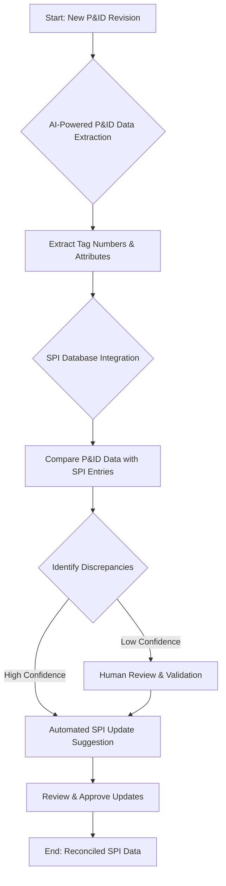

# AI-Driven P&ID Tag Reconciliation: Eliminating Manual Errors in SPI Data

## Abstract

In complex engineering projects, maintaining consistency between Process & Instrumentation Diagrams (P&IDs) and detailed instrument specifications in SmartPlant Instrumentation (SPI) is a monumental task. The traditional manual reconciliation process is notoriously time-consuming, prone to human error, and a significant bottleneck that can lead to costly rework, delays, and even safety concerns. This post explores how Artificial Intelligence (AI) is revolutionizing P&ID tag reconciliation, offering unprecedented levels of accuracy and efficiency, and fundamentally transforming engineering workflows.

## The Challenge of Manual P&ID to SPI Reconciliation

P&IDs are the foundational documents of any process plant, depicting process flow, piping, and instrumentation details. Each instrument on a P&ID is assigned a unique tag number, which then needs to be meticulously documented and managed within tools like SmartPlant Instrumentation (SPI). SPI serves as the central repository for all instrument data, including datasheets, specifications, and calibration details.

The challenge arises when P&IDs undergo revisions. Every change to an instrument tag, its attributes, or its location on a P&ID must be manually reflected in SPI. This cross-referencing and data entry process is fraught with difficulties:

*   **Complexity and Volume:** Modern plants can have tens of thousands of instrument tags across hundreds of P&IDs. Each tag has numerous associated attributes that must be consistent.
*   **Human Error:** Manual transcription, copy-pasting, and visual comparison are inherently susceptible to errors. A misplaced digit, a skipped line, or a misinterpretation can cascade into significant issues.
*   **Time Consumption:** The sheer volume of data means reconciliation often takes weeks, if not months, consuming valuable engineering man-hours that could be better spent on higher-value tasks.
*   **Project Impact:** Inconsistencies between P&IDs and SPI can lead to:
    *   **Procurement Delays:** Ordering the wrong instrument, or an instrument with incorrect specifications.
    *   **Construction Rework:** Field modifications due to mismatched data.
    *   **Commissioning Problems:** Issues during startup due to incorrect configuration.
    *   **Operational Risks:** Safety incidents stemming from instruments not performing as expected due to erroneous data.

These challenges highlight an urgent need for a more robust and efficient solution.

## How AI Transforms Tag Reconciliation

AI offers a powerful paradigm shift in P&ID tag reconciliation by automating and intelligentizing tasks that were once manual and error-prone. The transformation occurs in several key stages:

### 1. Automated Data Extraction from P&IDs

The first step is accurately extracting data from P&IDs. Traditional methods often involve engineers manually reading drawings and inputting data into spreadsheets or directly into SPI. AI, particularly Computer Vision and Natural Language Processing (NLP), can automate this:

*   **Optical Character Recognition (OCR):** Advanced OCR can accurately read text from P&ID images (scanned or digital), identifying instrument tags, descriptions, and line numbers. Modern AI-powered OCR is robust enough to handle variations in font, orientation, and image quality.
*   **Symbol Recognition:** Machine learning models trained on engineering symbols can identify and classify instruments (e.g., valves, transmitters, control loops) on a P&ID, correlating them with their respective tags.
*   **Layout Understanding:** AI can understand the spatial relationship between text and symbols, linking tags to the correct instruments and their associated process lines. This goes beyond simple text extraction, enabling semantic understanding of the drawing.

### 2. Intelligent Data Matching and Discrepancy Identification

Once P&ID data is extracted, the next critical step is comparing it with existing SPI data. This is where AI's analytical power truly shines:

*   **Fuzzy Matching Algorithms:** Instead of rigid, exact matches, AI uses fuzzy matching to identify tags that are *nearly* identical, flagging minor discrepancies (e.g., "PT-101" vs. "PT101"). This is crucial for catching subtle human errors.
*   **Semantic Comparison:** AI models can compare not just tag numbers but also associated attributes (e.g., service description, instrument type, operating range). If a P&ID shows a "Pressure Transmitter" with a specific tag, the AI checks if the corresponding SPI entry's description aligns, even if the wording isn't identical.
*   **Anomaly Detection:** AI can learn normal data patterns. Any deviation—a tag in P&ID with no counterpart in SPI, or an SPI entry with no P&ID reference—is flagged as an anomaly requiring review.
*   **Confidence Scoring:** Each identified discrepancy is assigned a confidence score. High-confidence discrepancies can be auto-corrected or routed for quick approval, while low-confidence items are escalated for human engineer review.

### 3. Workflow Automation and Reporting

Beyond identification, AI streamlines the entire reconciliation workflow:

*   **Automated Update Suggestions:** For high-confidence matches and identified discrepancies, the AI system can generate suggested updates for the SPI database.
*   **Interactive Dashboards:** Engineers get a dashboard showing all discrepancies, their confidence scores, and suggested resolutions, enabling rapid review and approval.
*   **Audit Trails:** Every automated action and human override is logged, providing a complete audit trail for compliance and quality control.

## A Real-World Example: Accelerating Project X's Instrumentation Deliverables

Consider "Project X," a mid-sized refinery expansion project involving 250 P&IDs and approximately 15,000 instrument tags.

### Before AI: The Manual Ordeal

Historically, Project X’s instrumentation team would dedicate two senior instrument engineers and three junior data entry specialists to P&ID-SPI reconciliation for each major P&ID revision. This process involved:

1.  **Manual Tag Extraction:** Visually identifying each instrument tag and its associated data on every P&ID.
2.  **Spreadsheet Compilation:** Manually entering this data into a master Excel spreadsheet.
3.  **Cross-Referencing:** Comparing the Excel spreadsheet against the SPI database, line by line.
4.  **Discrepancy Logging:** Manually noting all differences, categorizing them, and proposing changes.
5.  **SPI Updates:** Manually updating SPI entries based on approved changes.

This entire cycle for a single major P&ID revision took approximately **6-8 weeks**, with an average of **5-7% data error rate** initially, requiring multiple iterations of review and correction. The total effort for one revision amounted to roughly **2400-3200 man-hours**.

### With AI: A Paradigm Shift in Efficiency

Implementing an AI-driven P&ID tag reconciliation system transformed Project X’s workflow:

1.  **AI Data Extraction:** The AI system was fed all P&ID PDFs (including scanned legacy drawings). Within **48 hours**, it extracted all 15,000 tags and over 100,000 associated attributes.
2.  **Intelligent Comparison:** The extracted data was automatically compared against the SPI database using fuzzy matching and semantic analysis.
3.  **Discrepancy Reporting:** The AI generated a comprehensive report identifying all discrepancies with confidence scores. High-confidence matches (e.g., minor formatting differences) were auto-resolved.
4.  **Human-in-the-Loop Review:** The instrumentation team focused solely on reviewing a filtered list of ~200 low-confidence discrepancies or critical data mismatches via an interactive dashboard.

**Measurable Outcome:** The total time for P&ID-SPI reconciliation for a major revision was reduced from **6-8 weeks to less than 1 week**. The initial data error rate dropped to **less than 0.5%**, significantly reducing rework. The man-hour effort per revision was slashed by **over 80%**, freeing up senior engineers for critical design work. This resulted in an estimated **annual saving of $1.5 million** for Project X in engineering man-hours alone, not including the downstream benefits of reduced construction delays and improved operational reliability.

### Workflow Diagram

## Implementing AI for Your Reconciliation Process

Adopting AI for P&ID tag reconciliation requires a structured approach:

1.  **Assess Data Readiness:** Ensure your P&IDs and existing SPI data are in a suitable format. While AI can handle variations, cleaner input always yields better results.
2.  **Pilot Project:** Start with a smaller, manageable pilot project to demonstrate value and fine-tune the AI models to your specific project standards and data nuances.
3.  **Choose the Right Solution:** Evaluate commercial off-the-shelf AI solutions, open-source tools, or custom-built platforms depending on your specific needs, budget, and integration requirements. KU Automation specializes in tailoring these solutions.
4.  **Integrate with Existing Systems:** Seamless integration with your CAD, EDMS (Engineering Document Management System), and SPI systems is crucial for a smooth workflow.
5.  **Training and Adoption:** Provide adequate training for your engineering team to utilize the new AI tools effectively and understand the human-in-the-loop validation process. Change management is key to successful adoption.

## Conclusion

AI-driven P&ID tag reconciliation is no longer a futuristic concept; it is a proven solution that addresses one of the most persistent challenges in engineering data management. By automating data extraction, intelligently identifying discrepancies, and streamlining update processes, AI empowers engineering firms to achieve unprecedented levels of accuracy, significantly reduce project timelines, and reallocate valuable human capital to innovation and complex problem-solving. Embracing this technology is not just an efficiency gain; it's a strategic imperative for any firm looking to maintain a competitive edge in today's demanding engineering landscape. The time to eliminate manual errors and embrace intelligent automation for SPI data is now.