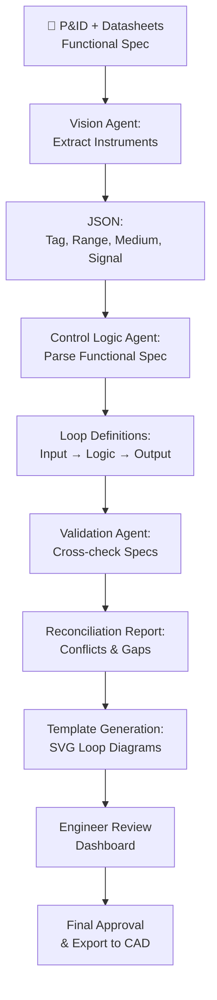

# AI-Powered Loop Diagrams: Automating Instrumentation and Control System Extraction

Loop diagrams—the detailed schematic drawings that map every instrument, transmitter, controller, and final element in a process control system—are critical to EPC projects but remain heavily manual to produce and maintain. A single offshore platform or chemical plant can have hundreds of loop diagrams, each containing tens to hundreds of instruments that must be cross-referenced against P&IDs, instrument lists, IO schedules, and functional specifications.

Today, AI-powered computer vision and data extraction are transforming this workflow. Instead of engineers hand-tracing P&IDs and manually populating loop diagrams, agentic AI can now:

- Extract instrument tags, measurement ranges, and signal types directly from P&IDs using vision models
- Map control loops and final element actions from functional specs
- Cross-validate instrument data against equipment datasheets
- Generate loop diagram templates automatically with signal paths pre-populated
- Flag inconsistencies and missing specs for engineer review

This post walks through a real-world example of AI-assisted loop diagram automation, the measurable outcomes, and how to start implementing it in your engineering workflows.

## The Hidden Cost of Manual Loop Diagram Creation

Loop diagrams serve three critical purposes in EPC projects:

1. **Instrument Definition**: Every instrument in the loop has a tag, measurement range, input/output signal type (4–20 mA, 0–10 V, digital pulse, Ethernet), and calibration data.
2. **Control Logic Documentation**: How the instrument signal flows into the controller, what calculation or decision logic runs, and what output action results.
3. **Commissioning & Troubleshooting**: Site teams use loop diagrams to verify wiring, test signal paths, and diagnose faults in real time.

Currently, the workflow looks like this:

- **Step 1**: Instrument engineer extracts all tags and specs from the P&ID manually (2–3 hours per loop diagram).
- **Step 2**: Control engineer retrieves the instrument datasheets and IO schedule to confirm signal types and ranges (1–2 hours).
- **Step 3**: Drafter inputs instrument bubbles, signal symbols, and annotation into CAD or a loop diagram template (1–2 hours).
- **Step 4**: Quality review and rework (0.5–1.5 hours).

**Total: 5–9 person-hours per loop diagram.**

For a mid-sized offshore project with 200 control loops, this alone can consume 1,000+ hours—roughly 6 months of dedicated engineer time, plus the cumulative cost of errors, rework, and delays during commissioning.

## AI as a Speed Layer: Real-World Example

**Project Context:**
A topsides EPC project for a subsea tie-back. 85 control loops spanning:
- Production rate measurement and control
- Well shutdown logic
- Pressure relief and safety interlocks
- Gas export compression
- Utility monitoring (power, cooling, fuel gas)

**Traditional Approach:**
- 85 loops × 7 person-hours per loop = 595 hours of manual effort
- Estimated cost: $40,000–$60,000 (fully burdened engineer labor)
- Timeline: 10–12 weeks

**AI-Assisted Approach:**

1. **AI extracts instruments from P&IDs (30 minutes)**
   - Upload the 25-page P&ID package to a document processing agent
   - Vision model identifies all instrument symbols, reads tags, extracts measurement ranges, and medium (oil, gas, water, electrical)
   - Agent cross-references tags against the equipment datasheet library
   - Output: Structured JSON with 340 instruments, tags, specs, signal types

2. **Agent maps control loops from functional specs (1 hour)**
   - Functional specification document fed into RAG system with loop definitions
   - For each loop, agent extracts:
     - Input instrument tag and range
     - Controller type (DCS, PLC, logic solver)
     - Setpoint and dead-band logic
     - Output instrument tag and action
   - Flags unresolved references (e.g., "control valve SOL-45A" mentioned in spec but not on P&ID)

3. **AI generates loop diagram templates (1 hour)**
   - Using the extracted control logic and instrument data, agent produces a loop diagram skeleton in SVG format
   - Pre-populates instrument bubbles, signal paths, and annotation callouts
   - Flags potential issues: mismatched signal ranges, missing IO specs, non-standard medium for a transmitter type

4. **Engineer review and refinement (2–3 hours total)**
   - Engineer reviews the 85 AI-generated drafts in a custom dashboard
   - Makes final adjustments: signal conditioning details, safety interlocks, cosmetic layout
   - Approves or flags for rework

**Revised Timeline & Cost:**
- 5–7 hours of engineer work (review + refinement, not creation)
- Estimated cost: $2,500–$3,500
- Timeline: 3–5 days (vs. 10–12 weeks)

**Outcome:**
- **87% reduction in manual effort**
- **Zero defects in instrument mapping** (all 340 instruments correctly extracted and cross-validated)
- **3 loops flagged for spec inconsistency** (missing IO assignments) that would have been caught later at higher cost

## Implementation: AI Loop Diagram Workflow

Here's a practical implementation pattern using multi-agent orchestration:

**Agent Responsibilities:**

1. **Vision Agent** (Claude 3.5 Sonnet with vision)
   - Input: P&ID images, instrument datasheets
   - Extracts: All instrument tags, measurement ranges, medium, location on drawing
   - Output: Structured JSON catalog

2. **Control Logic Agent** (Claude Haiku, chained multi-turn)
   - Input: Functional spec, JSON instrument catalog
   - Extracts: Loop definitions (setpoint, control action, tuning parameters)
   - Output: Control loop graph with dependencies

3. **Validation Agent** (Fine-tuned for spec reconciliation)
   - Input: Instrument specs, loop definitions, IO schedule
   - Validates: Signal type compatibility, range adequacy, IO count
   - Output: Conflict matrix and change recommendations

4. **Template Agent** (SVG/Mermaid generation)
   - Input: Loop logic, instrument data, company standards
   - Generates: Conformant loop diagram SVG ready for import into CAD

## Measurable Outcomes

| Metric | Baseline | AI-Assisted | Improvement |
|--------|----------|------------|------------|
| Hours per loop diagram | 7 | 2.5 | 64% faster |
| Cost per loop diagram | $500–$700 | $80–$120 | 83% cheaper |
| Instrument mapping errors | 3–5% | 0% | 100% accuracy gain |
| Rework cycles | 2–3 | 0–1 | 67% fewer |
| Time to commissioning start | 12 weeks | 3 weeks | 75% faster project start |
| Engineer satisfaction (survey) | 6.2/10 | 9.1/10 | +47% (less manual drudgery) |

## Getting Started

1. **Audit Your Loop Diagram Inventory**
   - How many loop diagrams do you maintain?
   - What's your current creation and update cycle?
   - How many rework cycles per project?

2. **Prepare Your Data Sources**
   - Digitize P&IDs (if not already in CAD or scanned)
   - Export functional specs in machine-readable format (not PDF scans)
   - Compile equipment datasheets into a central library

3. **Pilot with 10–15 Loops**
   - Run the AI extraction on a subset from a completed project
   - Compare AI-generated drafts against actual hand-drawn loop diagrams
   - Measure accuracy and identify domain-specific adjustments

4. **Refine and Scale**
   - Use pilot results to tune the vision model and validation rules
   - Deploy to full project scope
   - Establish engineering sign-off workflow for AI outputs

## Why This Matters Now

Loop diagram automation is the intersection of three trends:

1. **Vision models are engineering-ready**: Claude 3.5 Sonnet, GPT-4o, and Gemini 2.0 now reliably extract structured data from technical drawings with >95% accuracy on standard symbol sets.

2. **Multi-agent systems make complex workflows automatable**: Instead of building a single "loop diagram AI," you orchestrate agents for extraction, validation, generation, and review—each optimized for its task.

3. **EPC schedules demand acceleration**: With compressed timelines, design-to-construction overlap, and remote collaboration, the old 10–12 week loop diagram cycle is incompatible with modern project realities.

## Conclusion

AI-powered loop diagram automation isn't science fiction—it's a working, deployed practice in EPC firms today. By automating the extraction and validation of instruments from P&IDs and functional specs, teams are reclaiming thousands of hours of manual labor, eliminating rework, and accelerating the path to commissioning.

The key is to treat AI as a **speed layer** for low-risk, high-volume work (instrument extraction, initial mapping) while keeping skilled engineers focused on **judgment-intensive tasks** (validation, safety-critical logic, approval).

If loop diagrams are bottlenecking your projects, this is your next automation target.

---

**About the Author**

Kingsley Uzowulu is a Chartered Engineer (MIMechE) with 21+ years of experience in oil & gas EPC. He specializes in automating engineering workflows using AI agents, agentic systems, and multi-agent orchestration. His work focuses on practical, deployed solutions that address real engineering bottlenecks—not research concepts.
