# Automating Pipe Spool MTO from Isometric Drawings: AI-Powered Quantity and Specification Extraction

Material take-off (MTO) from isometric drawings is one of the most error-prone, time-consuming tasks in piping design and construction. For every pipe spool, support, flange, and fitting, estimators manually cross-reference PDF isometrics against P&ID line lists, counting components, measuring lengths, and recording specifications. A single mid-scale project with 200+ isometric sheets can consume weeks of manual effort. Worse, manual MTOs are riddled with missing items, incorrect quantities, and spec mismatches that cascade into procurement delays and field rework.

AI-powered OCR and computer vision can now automatically extract pipe routing, component quantities, and material specifications directly from isometric images, cutting MTO production time by 60–80% while improving accuracy to >95%.

## The Manual MTO Pain Point

In a typical oil & gas or power EPC project, here's how material take-off flows today:

1. **Design Release**: Isometric drawings (PDF or TIFF images) are released for 3D piping models.
2. **Manual Counting**: Estimators open each isometric on screen, zoom in, and manually count:
   - Pipe segments (by size and material grade)
   - Fittings (elbows, tees, crosses, reducers, by size and class)
   - Flanges (by size, facing, and ASME class)
   - Valves (by type and size)
   - Supports and clamps (by type and spacing)
   - Bolts, gaskets, and small-bore hose
3. **Cross-Referencing**: Each count is checked against P&ID, design datasheets, and vendor standards.
4. **Manual Transcription**: Data is entered into spreadsheets, BOM systems, or procurement forms—each entry a point of failure.
5. **Iteration**: Design changes mean re-counting entire spools; minor line-list updates are often missed.

**The Cost**:
- A 200-spool project at 45 minutes per isometric = 150 hours of estimator time.
- Rework due to missing or incorrect specs: 15–20% of procurement cost.
- Delayed material releases that compress construction schedules.

## How AI Extracts MTO from Isometrics

Modern computer vision + OCR stacks can now parse isometric drawings with engineering-grade accuracy:

### 1. **Image Preprocessing & Vectorization**
AI ingests isometric PDFs or TIFF files and converts them to high-resolution raster images, then applies edge-detection and noise-filtering to isolate line work from annotations.

### 2. **Symbol Recognition & Tagging**
Trained vision models identify:
- **Pipe sections**: Thickness and dashing patterns indicate size and material grade (e.g., heavy wall, stainless, Schedule 80).
- **Fitting symbols**: Elbows (90°, 45°), tees, crosses, reducers—classified by angle and reducer type.
- **Flanges and valves**: Identified by shape and orientation.
- **Dimension annotations**: Bounding boxes and OCR extract pipe lengths, pressure classes, and material call-outs.

### 3. **OCR & Specification Parsing**
Optical character recognition extracts text annotations from isometrics:
- Line size and material (e.g., "1½ INCH, SCH 80, CS" = 1½" Carbon Steel, Schedule 80).
- Pressure and temperature ratings.
- Valve types and classes.
- Insulation and tracing codes.

### 4. **Bill-of-Materials Assembly**
The AI aggregates extracted data into a structured BOM:
```
Spool: MAIN-001
  Pipe (1½" CS, SCH 80): 28 feet
  90° Elbow (1½", 3000#): 3 qty
  Tee (1½", 3000#): 2 qty
  Flange (1½", RTJ, 3000#): 4 qty
  Gate Valve (1½", 2500#): 1 qty
  Support Clamp (1½" Heavy Duty): 8 qty
  Fasteners (¾" Stud, A193-B7): 32 qty
```

### 5. **Reconciliation & Flagging**
The system cross-checks extracted data against:
- P&ID line lists for pressure, temperature, and fluid service consistency.
- Design standards (API 570, ASME B31.3) for reducer types, valve end connections, and rating selections.
- Vendor BOMs for standard flange bolt counts and configurations.

**Anomalies flagged for review**: Missing components, spec mismatches, unusual configurations.

## Real-World Example: Mid-Scale Petrochemical Revamp

**Context**: A 400-ton piping revamp for a crude stabilization unit, 75 isometric drawings, 500+ line items.

**Manual Approach**:
- 3 estimators, 2 weeks.
- 850 line items extracted; 127 errors (15%) identified only during procurement.
- Rework cost: $180K in expedite fees and material credits.

**AI-Assisted Approach**:
- AI scans all 75 isometrics in 4 hours.
- Initial BOM: 485 items, 92% accuracy on first pass.
- 38 anomalies flagged (missing flanges, pressure-class inconsistencies, undersized supports).
- 1 estimator reviews flagged items: 2 days to resolve and finalize.
- Final BOM accuracy: >99%.
- Savings: 12 days of labor ($24K) + zero rework.
- **Net benefit**: $156K in avoided delays and errors.

## Workflow Diagram

```mermaid
graph LR
  A["Isometric PDFs<br/>(75 sheets)"] -->|Batch Ingest| B["AI Vision<br/>OCR Engine"]
  B -->|Extract Components| C["Structured BOM<br/>+ Flagged Anomalies"]
  C -->|P&ID & Spec<br/>Reconciliation| D["Design Review<br/>Checklist"]
  D -->|1 Estimator<br/>~2 days| E["Validated<br/>Material List"]
  E -->|Procurement<br/>Interface| F["RFQ<br/>Generation"]
  F --> G["Vendor Quotes"]
  
  style A fill:#e1f5ff
  style B fill:#fff9c4
  style C fill:#c8e6c9
  style D fill:#ffe0b2
  style E fill:#f8bbd0
  style F fill:#e1bee7
```



## Measurable Outcomes

Organizations adopting AI-assisted MTO from isometrics report:

| Metric | Manual | AI-Assisted | Gain |
|--------|--------|-------------|------|
| **Time per 100 isometrics** | 120–150 hrs | 18–24 hrs | 85–90% reduction |
| **Accuracy (first pass)** | 85–90% | 92–96% | +7–11 points |
| **Accuracy (after review)** | 98–99% | 99.5%+ | +0.5–1.5 points |
| **Rework cost (100-spool project)** | $80K–$150K | $5K–$15K | 80–95% reduction |
| **Design change turnaround** | 2–3 days | 4–6 hours | 80% faster |
| **Estimator effort per project** | 600 hrs | 80–120 hrs | 80–85% reduction |

## Implementation Roadmap

### Phase 1: Pilot (Weeks 1–4)
- Collect 20–30 representative isometric samples (mix of pressure classes, materials, spool complexity).
- Run AI extraction; validate against manual reference MTOs.
- Measure accuracy, time, and cost baseline.
- Identify model gaps (unusual fittings, local design conventions, non-standard annotations).

### Phase 2: Tuning (Weeks 5–8)
- Fine-tune vision model on company-specific isometric styles, symbology, and text conventions.
- Create a **custom symbol dictionary** (e.g., local vendor abbreviations, non-standard fitting representations).
- Build P&ID + line-list reconciliation rules aligned with design standards.
- Establish SOP for flagged-item review and quick-fix workflows.

### Phase 3: Rollout (Week 9+)
- Process full design package (all issued isometrics).
- Integrate AI BOM output into procurement ERP or BOM system.
- Train procurement team on reviewing AI-flagged anomalies.
- Measure actual savings: labor hours, procurement cycle time, rework cost.

## Technical Stack & Tools

**Vision & OCR**:
- **Anthropic Claude's multimodal vision** for high-fidelity isometric parsing.
- **pytesseract** or **Paddle OCR** for embedded text extraction.

**Data Extraction & Structuring**:
- **Python + pandas** for BOM aggregation and reconciliation logic.
- **SQLAlchemy** for schema-driven validation against P&ID and design standards.

**Reconciliation Logic**:
- **Fuzzy matching** (FuzzyWuzzy, difflib) to link extracted components to P&ID line identifiers.
- **Custom rules engine** to flag pressure-class mismatches, missing flanges, undersized supports.

**Integration**:
- **REST APIs** to push validated BOMs into procurement systems (SAP, Oracle, NetSuite).
- **PDF generation** for transmittal packages ready for vendor RFQs.

## Key Considerations

### 1. **Symbol Ambiguity**
Isometric conventions vary by design office and vendor. A vision model trained on one firm's drawings may misidentify symbols in another's. **Mitigation**: Fine-tune on company samples; maintain a local symbol reference library.

### 2. **Annotation Quality**
Faded scans, low-resolution PDFs, or handwritten annotations defeat OCR. **Mitigation**: Require design release standards (minimum 300 DPI, printed/native PDF, legible callouts).

### 3. **Non-Standard Items**
Specialty fittings (custom elbows, reducing tees, orifice plates) may not be in the training model. **Mitigation**: Human reviewers must spot-check for missing or mis-classified items; iterate on examples.

### 4. **Regulatory Compliance**
MTOs feed into procurement, which must comply with pressure equipment directives (PED), material certifications, and traceability. AI extractions must be auditable and traceable back to source drawings. **Mitigation**: Log all AI decisions; maintain full redlines between AI BOM and approved final BOM.

## Adoption Risks & Guardrails

- **Don't deploy AI MTO on mission-critical safety systems without human review**. All AI-extracted BOMs must undergo design review before procurement.
- **Maintain version control**: Link each AI BOM to source isometric revision and extraction model version.
- **Budget for tuning**: 4–6 weeks of model refinement on company-specific data is typical.
- **Plan for edge cases**: Expect 5–15% of extracted items to require manual correction; this is normal and valuable.

## Conclusion

Automating material take-off from isometric drawings is no longer a nice-to-have—it's a competitive necessity. AI-powered extraction cuts estimating time by 80%, improves accuracy, and frees skilled engineers to focus on design and compliance rather than manual data entry. For projects with 50+ isometrics, ROI is typically achieved within the first project cycle.

The path forward is clear: **ingest, extract, validate, iterate**. Start with a 20-spool pilot, measure the baseline, tune the model, then scale confidently into production workflows.

**Ready to automate your MTO pipeline?** The engineering firms leading this transition are already 3–4 projects ahead of the curve. Contact KU Automation to run a pilot on your next design package and see the difference AI-assisted extraction can make.

---

*Kingsley Uzowulu is a Chartered Engineer (MIMechE) and founder of KU Automation, specializing in AI-powered engineering workflows for EPC and manufacturing. Over 21 years in oil & gas design, he's guided dozens of firms through the transition from manual to AI-assisted procurement and operations.*