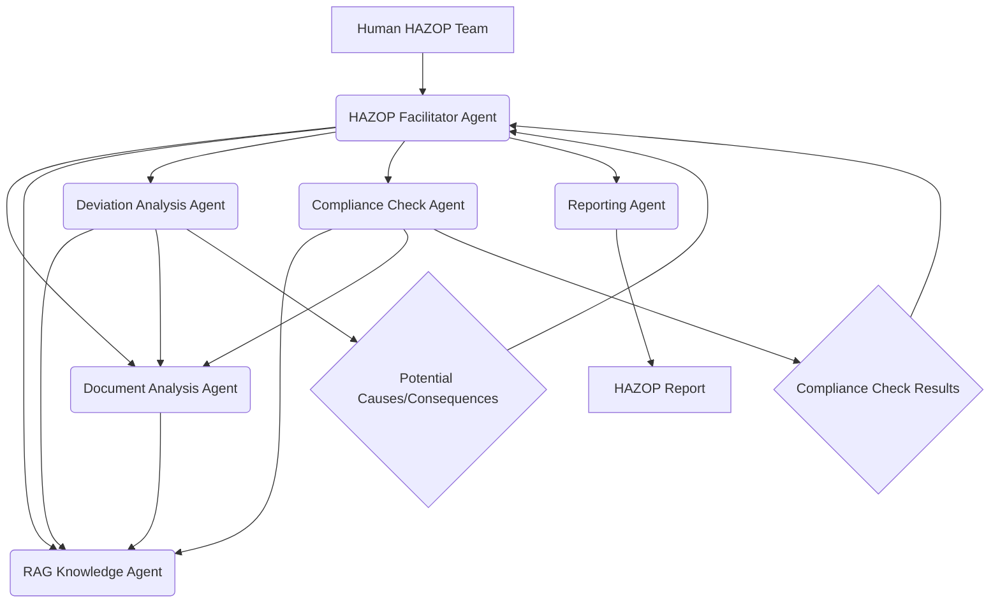

# Multi-Agent Systems for Complex Problem Solving in Engineering: A Knowledge Management Approach

In the intricate world of engineering, tackling complex problems—from optimizing large-scale industrial processes to ensuring the safety of critical infrastructure—demands more than just human ingenuity. It requires synthesizing vast amounts of information, coordinating diverse expertise, and navigating dynamic constraints. Traditional methods often fall short, leading to inefficiencies, delays, and suboptimal outcomes.

Enter Multi-Agent Systems (MAS) powered by Artificial Intelligence. These systems, where multiple specialized AI agents collaborate to achieve a common goal, are revolutionizing how engineering challenges are approached. When coupled with advanced Knowledge Management (KM) and Retrieval-Augmented Generation (RAG) techniques, MAS offers a powerful paradigm shift, enabling engineers to solve problems with unprecedented speed, accuracy, and depth.

## The Challenge: Why Traditional Approaches Fall Short

Engineering problems are inherently multi-faceted. Consider a typical EPC (Engineering, Procurement, and Construction) project:
*   **Data Overload:** Thousands of documents, specifications, drawings, and reports.
*   **Interdisciplinary Dependencies:** Process, piping, civil, structural, electrical, instrumentation, and safety engineers all need to coordinate.
*   **Dynamic Constraints:** Changes in regulations, material availability, or client requirements can ripple through the entire project.
*   **Knowledge Silos:** Expertise is often fragmented across individuals or departments, making holistic problem-solving difficult.

A human team, no matter how skilled, faces limitations in processing information at scale, maintaining perfect consistency across disciplines, and reacting instantaneously to new data. This is where the orchestrated intelligence of multi-agent systems shines.

## What Are Multi-Agent Systems (MAS) in Engineering?

At its core, a Multi-Agent System consists of:
*   **Agents:** Autonomous entities (software programs in this context) capable of perceiving their environment, reasoning, making decisions, and performing actions. Each agent has a specific role, knowledge base, and set of capabilities.
*   **Environment:** The shared space where agents interact, access data, and execute tasks (e.g., a project database, a simulation environment, or a document management system).
*   **Interaction Mechanisms:** Protocols for communication, coordination, and negotiation between agents.

In an engineering context, agents might specialize in areas like:
*   **Document Analysis Agent:** Extracts key information from P&IDs, datasheets, or contracts.
*   **Code Compliance Agent:** Verifies designs against industry standards (ASME, API, IEC).
*   **Simulation Agent:** Runs predictive models for process behavior or structural integrity.
*   **Risk Assessment Agent:** Identifies potential hazards or project delays based on various inputs.
*   **Knowledge Retrieval Agent (RAG):** Accesses and synthesizes information from an extensive knowledge base.

## The Role of Knowledge Management and RAG in MAS

For MAS to be truly effective in complex engineering environments, they need access to reliable, comprehensive, and up-to-date knowledge. This is where robust Knowledge Management (KM) strategies and Retrieval-Augmented Generation (RAG) systems become critical.

**Knowledge Management (KM):** This involves systematically collecting, organizing, sharing, and utilizing an organization's intellectual assets. For MAS, this means a structured repository of:
*   **Technical Specifications:** Industry codes, standards, client-specific requirements.
*   **Project Histories:** Lessons learned, past project data, best practices.
*   **Expert Databases:** Profiles of human experts and their areas of specialization.
*   **Ontologies and Taxonomies:** Structured relationships between engineering concepts, equipment, and processes.

**Retrieval-Augmented Generation (RAG):** RAG systems enhance the capabilities of large language models (LLMs) by allowing them to retrieve relevant information from an external knowledge base before generating a response. Instead of relying solely on their pre-trained knowledge (which can be outdated or lack domain-specific details), RAG-powered agents can:
1.  **Retrieve:** Query a vector database (populated from the KM system) with the context of the current problem.
2.  **Augment:** Integrate the retrieved, verified information with their internal reasoning.
3.  **Generate:** Produce highly accurate, context-aware, and verifiable outputs.

In an MAS, RAG agents act as the central nervous system, providing specialized knowledge to other agents on demand, ensuring that decisions are informed by the most relevant and precise data available. This significantly reduces the risk of hallucinations and improves the trustworthiness of AI-generated insights.

## Real-World Example: Optimizing HAZOP Study Lookups with MAS and RAG

HAZard and Operability (HAZOP) studies are critical safety reviews in the process industry. They involve systematically identifying potential hazards and operability problems in a process plant. These studies are incredibly knowledge-intensive, requiring access to:
*   Process Flow Diagrams (PFDs)
*   Piping & Instrumentation Diagrams (P&IDs)
*   Operating manuals
*   Safety standards and regulations
*   Past incident reports
*   Previous HAZOP reports

A typical HAZOP study can generate hundreds of action items and require immense manual effort to cross-reference documents and ensure consistency.

Here's how a Multi-Agent System with RAG can revolutionize HAZOP study lookups:

### **MAS Architecture for HAZOP Optimization:**

1.  **HAZOP Facilitator Agent:**
    *   **Role:** Orchestrates the entire process, interacting with human HAZOP team members, managing the session flow, and assigning tasks to other agents.
    *   **Capabilities:** Natural language understanding, session management, task delegation.

2.  **Document Analysis Agent:**
    *   **Role:** Parses PFDs, P&IDs, and other engineering documents to extract key entities (equipment, lines, instruments, safety devices), operating parameters, and design intents.
    *   **Capabilities:** OCR, NLP, computer vision for drawing interpretation.

3.  **RAG Knowledge Agent:**
    *   **Role:** Acts as the central knowledge hub. It queries a vector database (populated with all project documentation, industry standards, and past HAZOPs) to retrieve relevant information based on the context provided by other agents.
    *   **Capabilities:** Advanced semantic search, chunking, embedding generation, knowledge graph integration.

4.  **Deviation Analysis Agent:**
    *   **Role:** Given a process node and a deviation (e.g., "No Flow," "High Pressure"), it analyzes the P&ID, PFD, and operating philosophy to identify potential causes, consequences, and existing safeguards. It requests information from the Document Analysis Agent and the RAG Knowledge Agent.
    *   **Capabilities:** Rule-based reasoning, causal inference.

5.  **Compliance Check Agent:**
    *   **Role:** Verifies identified safeguards and design against relevant industry codes and company standards. It uses the RAG Knowledge Agent to retrieve specific code excerpts.
    *   **Capabilities:** Regulatory knowledge, cross-referencing.

6.  **Reporting Agent:**
    *   **Role:** Consolidates findings, action items, and justifications into a structured HAZOP report format.
    *   **Capabilities:** Natural language generation, report formatting.

### **Workflow Diagram (Mermaid):**

### **Measurable Outcome:**

**Objective:** Reduce the time spent on document lookup and cross-referencing during HAZOP studies by 60%, leading to a 20% reduction in overall HAZOP study duration and a 15% increase in the identification of obscure but critical hazards due to comprehensive knowledge synthesis.

**Current State (Manual):**
*   Engineers spend ~40% of HAZOP session time manually searching documents.
*   Total HAZOP duration: 100 hours for a complex P&ID.
*   Hazard identification rate: Baseline.

**Future State (MAS with RAG):**
*   **Document Lookup Time:** Reduced from 40% to 15% of session time. The RAG Knowledge Agent provides instant, context-aware information.
*   **HAZOP Duration:** 80 hours (20% reduction).
*   **Hazard Identification:** 15% increase in critical, non-obvious hazards identified due to the Deviation Analysis Agent's ability to cross-reference subtle interdependencies and the Compliance Check Agent's thorough standard adherence validation.
*   **Data Consistency:** Drastically improved as agents work from a single, canonical knowledge base.

This translates into significant cost savings, faster project delivery, and, most importantly, enhanced safety and reliability for engineering assets.

## The Future of Engineering Problem Solving

Multi-Agent Systems, empowered by advanced knowledge management and RAG, are not just theoretical constructs. They represent a tangible pathway to addressing some of engineering's most entrenched challenges. By automating information synthesis, standardizing compliance checks, and facilitating intelligent collaboration between specialized AI entities, engineering firms can unlock new levels of efficiency, accuracy, and innovation.

The shift is from individual human effort to orchestrated intelligence, where the collective "mind" of specialized AI agents, continually fed and validated by a robust knowledge base, can solve problems far beyond the reach of any single human or traditional system. Embracing this approach means moving beyond simple automation to true autonomous and intelligent problem-solving, driving a new era of engineering excellence.
