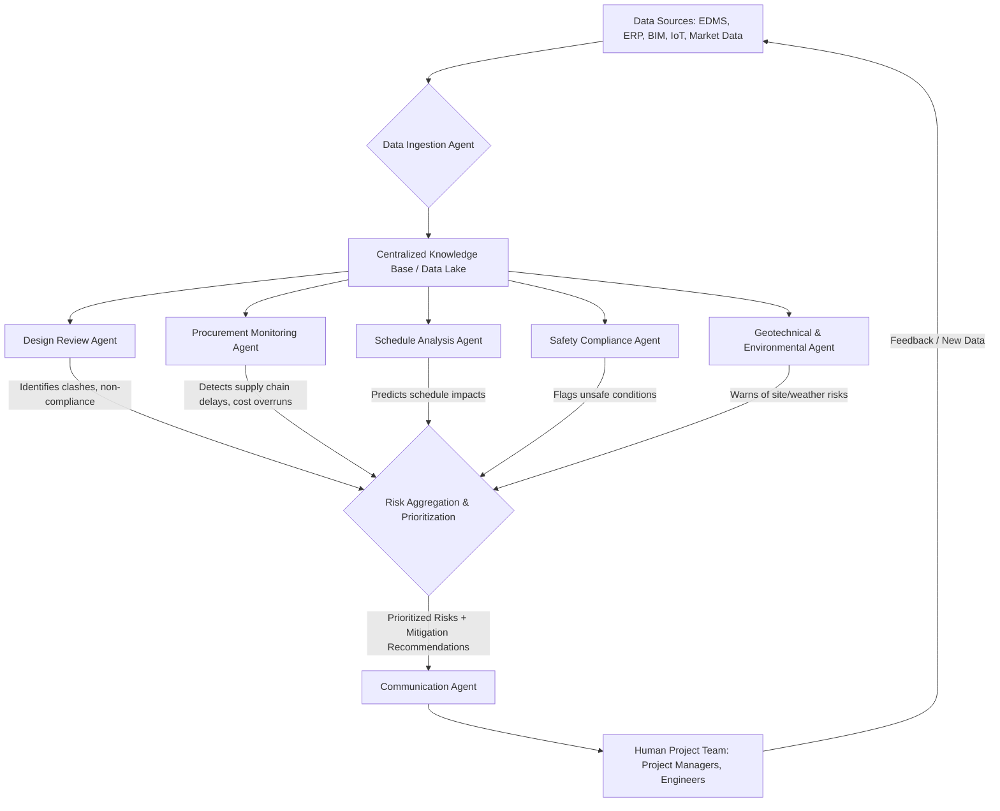

## Multi-Agent Systems for Proactive Risk Identification in Engineering Projects

In the intricate world of engineering, where projects span years, involve colossal budgets, and carry significant safety implications, proactive risk identification isn't just a best practice—it's a necessity. Traditional risk management approaches, often reliant on periodic reviews and manual data analysis, struggle to keep pace with the sheer volume and velocity of information generated in modern, complex projects. This is where **Multi-Agent Systems (MAS)** emerge as a transformative force, offering a dynamic and intelligent solution for identifying potential risks long before they escalate into costly problems.

### The Challenge of Risk Identification in Complex Engineering Projects

Consider an EPC (Engineering, Procurement, and Construction) project for a new petrochemical plant or a large-scale infrastructure development. Thousands of documents are generated daily: design specifications, vendor data, procurement schedules, construction reports, safety checklists, and more. Each piece of information holds clues about potential risks—a slight delay in a critical vendor's delivery, an emerging conflict between design disciplines, or an unforeseen ground condition.

The limitations of traditional methods become starkly apparent:

*   **Information Overload:** Human teams are overwhelmed by the sheer volume of data, leading to missed signals.
*   **Siloed Data:** Information often resides in disparate systems, making holistic risk assessment difficult.
*   **Reactive vs. Proactive:** Most systems are designed to react to incidents rather than predict and prevent them.
*   **Human Bias and Fatigue:** Even the most experienced engineers can overlook subtle patterns or become fatigued, impacting the thoroughness of risk reviews.
*   **Dynamic Environments:** Project conditions are constantly changing, making static risk registers quickly obsolete.

These challenges highlight an urgent need for intelligent, automated systems capable of continuous monitoring, contextual analysis, and early warning—capabilities that Multi-Agent Systems are uniquely positioned to deliver.

### Understanding Multi-Agent Systems (MAS)

A Multi-Agent System is a distributed artificial intelligence system composed of multiple interacting intelligent agents. Each agent is an autonomous entity capable of perceiving its environment, reasoning about its observations, making decisions, and performing actions to achieve specific goals.

Key characteristics of MAS include:

*   **Autonomy:** Agents can operate independently without constant human supervision.
*   **Reactivity:** Agents respond to changes in their environment.
*   **Pro-activeness:** Agents can initiate actions to achieve goals, rather than just reacting.
*   **Social Ability:** Agents can communicate, cooperate, and negotiate with other agents to achieve common or individual goals.

In an engineering context, this means we can deploy specialized agents to monitor different aspects of a project—design, procurement, schedule, safety, site conditions—and have them collaborate to identify complex, multi-faceted risks that no single agent (or human) could easily spot in isolation.

### MAS for Proactive Risk Identification: A Paradigm Shift

The application of MAS to proactive risk identification represents a significant paradigm shift. Instead of waiting for a risk to manifest, MAS actively hunt for anomalies, correlations, and predictive indicators across vast datasets.

Here’s how different types of agents can collaborate:

1.  **Data Ingestion Agents:** Continuously collect data from various sources (EDMS, ERP, BIM models, IoT sensors, weather feeds, market data). They preprocess and standardize data for other agents.
2.  **Design Review Agents:** Analyze CAD models, P&IDs, and design documents for clashes, compliance with codes/standards, and potential constructability issues. They can flag deviations from design intent or regulatory requirements.
3.  **Procurement Monitoring Agents:** Track vendor performance, material lead times, geopolitical events, and supply chain disruptions. They can predict delays or cost overruns based on real-time market data and historical patterns.
4.  **Schedule Analysis Agents:** Monitor project schedules, identify critical path activities, and simulate the impact of potential delays. They can flag activities at risk of falling behind due to resource constraints or dependencies.
5.  **Safety Compliance Agents:** Scan safety reports, incident logs, and site inspection data. They can identify emerging unsafe conditions or non-compliance with safety protocols, predicting potential accidents.
6.  **Geotechnical & Environmental Agents:** Monitor ground conditions, weather forecasts, and environmental impact assessments. They can predict risks related to soil instability, extreme weather events, or regulatory breaches.
7.  **Communication & Notification Agents:** Act as the interface to human project managers, aggregating insights from other agents, prioritizing risks, and sending actionable alerts. They can also facilitate inter-agent communication and resolve conflicts.

Through continuous interaction and data sharing, these agents form an intelligent network that provides a comprehensive, real-time risk landscape, enabling project teams to intervene early and mitigate threats.

### Real-World Example: Proactive Risk Identification in an Offshore Platform EPC Project

Let's consider a multi-billion dollar offshore platform EPC project in the North Sea. The project involves complex engineering, global procurement, and challenging marine construction.

**Traditional Approach Challenges:** Manual review of thousands of vendor documents, weekly schedule updates, and siloed data systems meant that critical information was often delayed or missed. A slight delay from a sub-vendor for a long-lead item, if not caught immediately, could propagate through the entire fabrication and installation schedule, leading to months of delays and hundreds of millions in liquidated damages.

**MAS Implementation:**

1.  **Procurement Agent:**
    *   **Perception:** Monitors purchase order (PO) statuses, vendor invoices, shipping manifests, customs clearance data, and global logistics news.
    *   **Reasoning:** Uses machine learning models to analyze historical vendor performance, current geopolitical stability, and shipping route congestion.
    *   **Action:** Detects a subtle slowdown in customs processing at a specific port combined with a public holiday in the region, inferring a potential 3-week delay for a critical subsea manifold delivery from a particular vendor.

2.  **Schedule Monitoring Agent:**
    *   **Perception:** Receives real-time updates from the master project schedule (Primavera P6), construction progress reports, and information from the Procurement Agent.
    *   **Reasoning:** Identifies the subsea manifold delivery as a critical path item for offshore installation. Performs a schedule impact analysis based on the potential delay reported by the Procurement Agent.
    *   **Action:** Flags a high-severity risk: "Potential 3-week delay in manifold delivery, projected 5-week impact on offshore installation phase."

3.  **Design Review Agent:**
    *   **Perception:** Scans the latest 3D model revisions, P&IDs, and equipment datasheets.
    *   **Reasoning:** Collaborates with the Schedule Monitoring Agent. If the manifold design is still undergoing minor revisions, it understands that the procurement delay might create a compressed window for final design approval and fabrication checks.
    *   **Action:** Raises a secondary risk: "Accelerated design freeze required for manifold if delivery delay confirmed, increasing potential for late design changes affecting fabrication."

4.  **Communication Agent:**
    *   **Perception:** Receives alerts from all other agents.
    *   **Reasoning:** Aggregates and prioritizes the manifold delay risk, its schedule impact, and the secondary design freeze risk. Formulates a concise summary with proposed mitigation actions.
    *   **Action:** Notifies the Project Director, Lead Procurement Engineer, and Lead Project Engineer via their preferred communication channel (e.g., Slack, email, dashboard alert) with a detailed report and recommendations: "Expedite alternative shipping routes, engage vendor leadership, re-sequence parallel activities, and fast-track final manifold design reviews."

**Measurable Outcome:** By detecting the nascent customs delay weeks in advance, the MAS enabled the project team to pivot proactively. They negotiated an expedited shipping solution, leveraged buffer time by adjusting other non-critical activities, and avoided the 5-week offshore installation delay. This averted an estimated **$50 million** in potential project overrun costs and maintained the critical path schedule.

### Workflow Diagram: MAS-Driven Risk Identification

The following Mermaid diagram illustrates the conceptual workflow of a Multi-Agent System for proactive risk identification in an engineering project:

**Description:** Raw data from various project systems (EDMS, ERP, BIM models, IoT sensors, market data) is first processed by the **Data Ingestion Agent** and stored in a **Centralized Knowledge Base**. Specialized agents like the **Design Review Agent**, **Procurement Monitoring Agent**, **Schedule Analysis Agent**, **Safety Compliance Agent**, and **Geotechnical & Environmental Agent** continuously analyze relevant subsets of this data. They interact with each other and feed their findings into a **Risk Aggregation & Prioritization** module. Finally, the **Communication Agent** translates these complex insights into actionable intelligence, delivering prioritized risks and mitigation recommendations to the **Human Project Team**, who then make informed decisions and provide feedback, closing the loop.

### Measurable Outcomes and Benefits

Implementing Multi-Agent Systems for proactive risk identification offers tangible, measurable benefits:

*   **Reduced Project Delays:** Early detection of critical path risks can reduce schedule overruns by **15-25%**.
*   **Significant Cost Savings:** Preventing delays and rework due to unforeseen issues can lead to **5-10%** cost savings on large projects.
*   **Enhanced Safety Performance:** Proactive identification of unsafe conditions can reduce incident rates by **20% or more**.
*   **Improved Resource Utilization:** By anticipating problems, teams can allocate resources more effectively, avoiding costly expediting or standby time.
*   **Better Decision Making:** Project leaders receive real-time, comprehensive risk intelligence, leading to more informed and timely decisions.
*   **Increased Project Predictability:** A clearer understanding of potential future states helps in setting more realistic expectations and achieving them.

### Implementation Considerations

While the benefits are clear, successful MAS implementation requires careful consideration:

*   **Data Integration:** Establishing robust pipelines to feed diverse data sources into a centralized, accessible format.
*   **Agent Design:** Defining clear roles, responsibilities, and communication protocols for each agent.
*   **Scalability:** Designing the system to handle increasing data volumes and agent complexity as projects grow.
*   **Human-in-the-Loop:** Ensuring that human experts remain central to decision-making and provide oversight and training for the MAS.
*   **Ethical AI:** Addressing biases in data and ensuring fair and transparent risk assessments.

### Conclusion

Multi-Agent Systems are poised to redefine risk management in engineering projects. By moving beyond reactive measures to truly proactive identification, MAS empower engineering teams to navigate complexity with unprecedented foresight. The ability to autonomously monitor, analyze, and predict risks across vast and varied data landscapes not only enhances project safety and efficiency but also delivers substantial financial benefits. For engineering firms aiming to stay competitive and deliver projects on time and within budget, embracing MAS for proactive risk identification is no longer an option—it's the strategic imperative for the future.