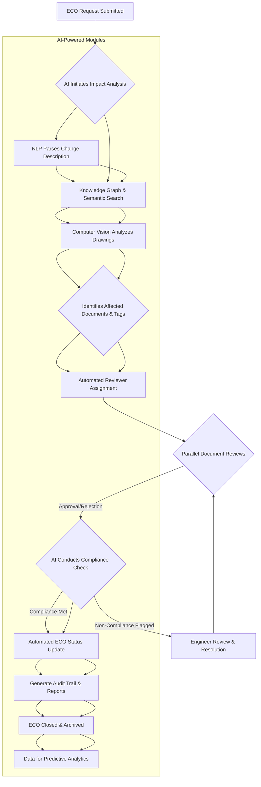

Engineering change orders (ECOs) are an inevitable part of any complex project, especially in sectors like oil & gas, infrastructure, and manufacturing. While necessary for correcting errors, adapting to new requirements, or optimizing designs, poorly managed ECOs can derail schedules, inflate costs, and introduce significant risks. Traditional ECO processes are often manual, siloed, and slow, leading to bottlenecks, communication breakdowns, and human error.

This is where AI-powered solutions are transforming change order management. By automating impact analysis, streamlining workflows, and enhancing compliance, AI offers a new paradigm for handling ECOs – moving from reactive firefighting to proactive, intelligent control.

## The Bottleneck of Traditional Engineering Change Orders

Imagine a large-scale EPC (Engineering, Procurement, and Construction) project. A minor design change in a piping and instrumentation diagram (P&ID) can ripple through hundreds of related documents: mechanical datasheets, structural drawings, electrical schematics, vendor documentation, and procurement lists. Each affected document needs review, revision, and approval, often involving multiple departments and external stakeholders.

The typical challenges include:

*   **Manual Impact Analysis:** Identifying all affected documents and disciplines is a painstaking manual effort, prone to oversight. Engineers spend hours cross-referencing documents, leading to delays and potential errors.
*   **Slow Approval Cycles:** Routing ECOs through various approval gates—engineering, procurement, construction, quality, client—often involves sequential reviews, email chains, and physical sign-offs, stretching cycle times from days to weeks.
*   **Lack of Centralized Data:** Information related to an ECO might be scattered across different systems (EDMS, ERP, project management software), making it difficult to maintain a single source of truth and track progress.
*   **Compliance Risk:** Ensuring every change adheres to project specifications, industry codes, and regulatory requirements is critical. Manual checks increase the risk of non-compliance, which can have severe legal and safety consequences.
*   **Resource Drain:** Highly skilled engineers spend valuable time on administrative tasks rather than core engineering work, impacting productivity and project efficiency.

These bottlenecks directly contribute to cost overruns, schedule delays, and heightened project risk.

## How AI Revolutionizes Change Order Management

AI brings intelligence and automation to every stage of the ECO lifecycle, addressing the core challenges head-on.

### 1. Intelligent Impact Analysis

This is perhaps the most significant breakthrough. Instead of manual cross-referencing, AI systems can automatically analyze proposed changes and identify all potentially affected documents, drawings, and data points across an entire project database.

**How it works:**

*   **Natural Language Processing (NLP):** AI models can read and understand the textual descriptions of proposed changes in an ECO request.
*   **Graph Databases & Knowledge Graphs:** Project data (documents, tags, equipment, connections) can be represented as a knowledge graph. When a change is proposed for a specific tag or equipment, the AI traverses this graph to pinpoint all directly and indirectly related entities.
*   **Computer Vision (CV):** For changes impacting drawings (P&IDs, electrical diagrams, structural layouts), computer vision algorithms can visually identify modified areas and cross-reference them with associated tag lists, BOMs, and datasheets.
*   **Semantic Search & Embedding:** Documents are embedded into vector databases, allowing the AI to perform semantic searches that go beyond keyword matching to find conceptually related content, even if different terminology is used.

**Measurable Outcome:** Reduces the time spent on initial impact assessment by **70-85%**, significantly cutting down the risk of missed dependencies.

### 2. Automated Workflow Orchestration and Routing

Once the impact is understood, AI automates the routing and approval process, ensuring that the right stakeholders review the right documents at the right time.

**How it works:**

*   **Rule-Based Automation & Machine Learning:** Based on the type, scope, and impact severity of a change, the AI system automatically assigns reviewers from relevant disciplines (e.g., if a P&ID change affects a pump, it routes to process, mechanical, and instrumentation engineers).
*   **Parallel Reviews & Smart Prioritization:** AI can enable parallel reviews where possible and dynamically prioritize ECOs based on their criticality and potential impact on the project schedule.
*   **Automated Notifications & Reminders:** Integrations with communication platforms (email, MS Teams, Slack) ensure reviewers receive immediate notifications and automated reminders, eliminating manual follow-ups.
*   **Audit Trails:** Every action, review, and approval is automatically logged, creating a comprehensive, immutable audit trail for compliance and historical analysis.

**Measurable Outcome:** Decreases ECO approval cycle times by **50-60%**, accelerating project progress and reducing delays.

### 3. Enhanced Compliance and Quality Assurance

AI acts as a vigilant assistant, ensuring that changes adhere to all required standards and specifications.

**How it works:**

*   **Automated Checklist Verification:** For standard changes, AI can automatically check against predefined checklists and project specifications, flagging any deviations.
*   **Code Compliance Checks:** In more advanced systems, AI can be trained on industry codes and standards (e.g., ASME, API) to identify potential non-compliance issues introduced by a change.
*   **Version Control Integration:** Seamless integration with document management systems ensures that only the latest approved revisions are used and that previous versions are archived correctly.

**Measurable Outcome:** Reduces compliance-related errors by **up to 90%**, significantly lowering project risk and rework.

### 4. Data-Driven Insights and Predictive Analytics

Beyond automation, AI provides valuable insights into the ECO process itself.

**How it works:**

*   **Performance Metrics:** Track key metrics like average cycle time, number of open ECOs, departmental bottlenecks, and the types of changes that generate the most rework.
*   **Predictive Modeling:** Analyze historical data to predict which types of changes are likely to cause delays or require extensive rework, allowing project managers to allocate resources proactively.
*   **Root Cause Analysis:** Identify common root causes of change orders, enabling organizations to implement preventative measures and improve initial design quality.

**Measurable Outcome:** Improves overall project predictability and allows for proactive resource allocation, leading to a **10-15% reduction in project contingency costs** related to changes.

## Real-World Example: Accelerating Valve Specification Changes in a Mega-Project

Consider a major oil & gas project involving hundreds of P&IDs and thousands of valves. A new safety regulation requires a change in the material specification for all isolation valves in high-pressure hydrogen service.

**Traditional Approach:**

1.  **Manual Search:** An engineer manually searches P&IDs for isolation valves, then checks the service conditions for hydrogen. This involves opening numerous documents.
2.  **Datasheet Update:** For each identified valve, the mechanical engineer updates its datasheet.
3.  **Cross-Referencing:** Manual cross-referencing is done to identify affected piping line lists, instrument indexes, procurement packages, and vendor documents.
4.  **Sequential Approvals:** Datasheets and associated documents are then sent through mechanical, process, piping, instrumentation, and safety departments for sequential review, often via email.
5.  **Documentation:** Manual updates to change logs and status trackers.
6.  **Timeline:** Weeks, with high potential for missed valves or incorrect updates.

**AI-Powered Approach:**

1.  **ECO Initiation:** An ECO is raised, describing the change: "Update material specification for isolation valves in high-pressure hydrogen service."
2.  **AI Impact Analysis:**
    *   **NLP:** Understands the change description.
    *   **Knowledge Graph/Semantic Search:** Instantly queries the project's knowledge graph (which links P&IDs, tags, datasheets, line lists, and service conditions). It identifies all isolation valves, their tag numbers, and verifies if they are in high-pressure hydrogen service.
    *   **Output:** A precise list of affected valve tags, their associated datasheets, P&IDs, line lists, and vendor document numbers.
3.  **Automated Workflow:**
    *   The system automatically creates tasks for the mechanical engineer to update the identified datasheets.
    *   Once datasheets are updated, the AI system automatically routes the revised documents in parallel to the relevant engineers (process, piping, instrumentation, safety) for review within a dedicated ECO platform, not email.
    *   Automated reminders are sent if reviews are pending.
    *   Changes to related documents (line lists, instrument indexes) are automatically flagged for review or auto-updated with human verification.
4.  **Compliance Check:** The AI runs a preliminary check against relevant material codes (e.g., NACE) to ensure the new specification complies with hydrogen service requirements.
5.  **Final Approval:** Once all parallel reviews are complete, the ECO is routed for final approval to the project manager and client representative.
6.  **Automated Documentation:** The system automatically updates the ECO log, version control, and generates an audit report.

**Outcome:** The entire process is completed in days, not weeks, with a significantly higher accuracy rate and a transparent audit trail. The risk of using incorrect materials is drastically reduced, ensuring project safety and compliance.

## Implementing AI for ECO Workflow Automation: A Phased Approach

Implementing AI in ECO management doesn't require a "big bang" approach. It can be phased to demonstrate value quickly.

**Phase 1: Intelligent Impact Analysis (Pilot)**
*   **Focus:** Automate the identification of affected documents and data points.
*   **Tools:** Integrate an NLP engine with your existing EDMS or a dedicated document processing platform. Start with a specific type of change (e.g., changes to equipment tags).
*   **Outcome:** Engineers spend less time searching and more time engineering.

**Phase 2: Automated Routing and Notifications**
*   **Focus:** Streamline the review and approval workflow.
*   **Tools:** Integrate with your project management software or build a custom workflow engine. Implement automated email/chat notifications and reminders.
*   **Outcome:** Faster approval cycles, reduced bottlenecks.

**Phase 3: Enhanced Compliance and Predictive Analytics**
*   **Focus:** Integrate automated compliance checks and gain data-driven insights.
*   **Tools:** Leverage machine learning models for anomaly detection and predictive analytics. Extend knowledge graphs to include regulatory codes.
*   **Outcome:** Improved quality, reduced risk, proactive decision-making.

## Workflow Diagram: AI-Powered ECO Management

Here’s a simplified workflow diagram illustrating the AI-powered ECO process:

## Conclusion: The Future of Engineering Change Management

AI-powered change order management is not just an incremental improvement; it's a fundamental shift in how engineering projects handle complexity and adapt to evolving requirements. By automating tedious manual tasks, accelerating approvals, and enforcing compliance with unprecedented accuracy, AI empowers engineering teams to maintain control, reduce risks, and deliver projects on time and within budget.

The journey towards fully autonomous ECO management begins with strategic adoption of AI tools, focusing on clear pain points and demonstrating measurable value at each step. For engineering firms ready to embrace the future, AI offers the key to unlocking new levels of efficiency, quality, and project success.

---
