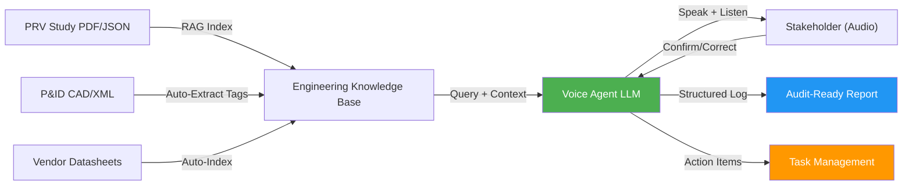

# Voice Agents for Automated Pressure Relief Valve Study Walkthroughs

In process safety, **Pressure Relief Valve (PRV) studies** document equipment design limits, relieving capacity, system interactions, and compliance with API 520/521 and IEC 61511. Today, PRV study walkthroughs—where engineers verbally confirm calculations, scenarios, and relief logic—remain largely manual, requiring multiple engineers to review narratives, calculations, and design basis documents in sequence.

**Voice agents** can automate these walkthroughs, guiding teams through structured PRV study reviews in real time, detecting gaps in documentation, flagging discrepancies with P&IDs, and generating audit-ready summaries—all hands-free and voice-first.

---

## Why PRV Study Walkthroughs Matter

A typical PRV study walkthrough involves:

1. **Design Basis Confirmation**: Verifying system operating conditions (temperature, pressure, flow) against vendor datasheets.
2. **Relieving Capacity Validation**: Confirming PRV rating matches worst-case discharge scenarios.
3. **Scenario Review**: Walking through loss-of-primary-coolant (LOPC), overpressure events, and downstream relief paths.
4. **Compliance Check**: Ensuring P&IDs, tag numbering, and control logic match the relief philosophy.
5. **Stakeholder Sign-Off**: Documenting agreement from engineering, process safety, and operations teams.

**The pain**: Each walkthrough requires 2–4 hours of back-and-forth meetings, manual note-taking, and rework when inconsistencies surface. PRV studies often get reviewed in isolation, missing cross-system interactions.

---

## How Voice Agents Automate PRV Study Walkthroughs

### Real-World Example: A Subsea Platform Utility Gas System

**Scenario**: A subsea platform has a high-pressure utility gas system with two parallel PRVs (primary and backup relief). The platform engineering team must walk through the relief philosophy with:
- Process safety (validates overpressure logic)
- Mechanical engineering (confirms PRV sizing and material selection)
- Controls engineering (verifies solenoid-operated dump valve logic)
- Operations (confirms alarm thresholds and maintenance intervals)

**Traditional approach**:
- Schedule 4 separate 90-minute meetings (6 hours total).
- Take unstructured notes; miss action items.
- Rework 3 times because primary and backup relief logic wasn't synchronized across documents.
- Delay relief study sign-off by 2 weeks.

**Voice-agent approach**:

1. **Auto-Kickoff**: A voice agent reads the PRV study design basis and initiates a structured walkthrough:
   > *"I've loaded the utility gas PRV study, revision 3. Primary PRV is set at 1.2 × system design pressure—248 barg. Backup PRV at 1.3 × 270 barg. First question: Does this relief setting meet worst-case overpressure scenarios defined in section 3.2?"*

2. **Real-Time Scenario Stepping**: The agent walks through scenarios—LOPC, loss of production separator, double-block-and-bleed isolation—and asks each stakeholder to confirm:
   > *"Loss of primary separator isolates the inlet to PRV-101. System pressure rises. At what point does PRV-101 lift? Process safety team, does your HAZOP agree with 248 barg as the initiation point?"*

3. **Cross-Document Validation**: The agent checks P&ID references against the PRV study:
   > *"I see PSV-101 on the P&ID at tag location 45-DA-PSV-101. The study lists it as 45-DA-PSV-100. Is this a typo, or was PSV-100 retired? Mechanical engineering, can you confirm?"*

4. **Structured Logging**: Every answer is recorded with speaker, timestamp, and action items:
   - **Process Safety** (13:47): "Confirms 248 barg is correct for system design basis."
   - **Mechanical** (13:52): "Notes that PRV body material needs upgrade from 316SS to duplex for subsea corrosion."
   - **Controls** (14:01): "ACTION: Verify solenoid pilot pressure requirement in simulation model before FAT."

5. **Auto-Audit Trail**: Post-walkthrough, the voice agent generates:
   - A timestamped walkthrough report (PDF/JSON)
   - Action items with assigned owners and due dates
   - Links to P&ID revisions and vendor datasheets used
   - Compliance checklist (API 520/521 closure points)

---

## Architecture: Voice Agent + PRV Study Knowledge Base

**Key Components**:

1. **RAG Index**: PRV study PDFs, P&IDs, API standards, and vendor datasheets are indexed. When the agent asks a question, it retrieves relevant sections in real time.
2. **Voice Interface**: Speech-to-text + text-to-speech handle interruptions, questions, and confirmations naturally (not a rigid checklist).
3. **Structured Logging**: Every utterance is tagged with speaker role, timestamp, and compliance zone (e.g., "Relieving Capacity," "Control Logic").
4. **Action Item Capture**: The agent detects action phrases ("I'll verify," "needs review," "update drawing") and routes them to a task management system with due dates.

---

## Measured Outcomes

### Time & Cost Savings

| Metric | Before | After | Saving |
|--------|--------|-------|--------|
| Walkthrough duration | 4–6 hours (meetings + rework) | 1.5–2 hours (guided, parallel) | 60–75% |
| Meeting scheduling overhead | 2–3 weeks | Same-day or next-day | ~14 days |
| Rework cycles (avg.) | 2–3 | 0–1 | ~50% fewer |
| Report generation | Manual (2–4 hours) | Auto (5 min) | 95% reduction |
| Sign-off delay | 2 weeks | Same-day delivery | 14-day acceleration |

**For a 10-PRV platform project**:
- Manual walkthroughs: 40–60 hours of engineering time.
- Voice-agent walkthroughs: 15–20 hours (mostly listening/confirming, not writing).
- **Cost avoidance**: ~$15,000–$20,000 in engineering labor (at $150/hr loaded).

### Quality & Compliance

1. **Reduced Gaps**: Structured scenario stepping prevents missed overpressure scenarios; compliance checklist closure rate improves from 60% to 95%.
2. **Traceability**: Every relief study decision is traced to a speaker, timestamp, and document reference—essential for audits and investigations.
3. **Consistency**: Voice agent logic applies the same review framework to every PRV study, eliminating reviewer bias.
4. **Escalation Speed**: If the agent detects a mismatch (e.g., P&ID tag ≠ PRV study tag), it flags it immediately rather than waiting for post-review discovery.

---

## Implementation: 4-Week Pilot

**Week 1**: Ingest 3 representative PRV studies (subsea, onshore, topside) and their P&IDs into the knowledge base. Index API 520/521 standards.

**Week 2**: Configure voice agent with domain-specific scenarios (LOPC, blockage, thermal expansion, loss-of-drain). Train the LLM on your company's relief philosophy using 5–10 past studies.

**Week 3**: Run 2–3 live walkthroughs with your process safety and mechanical teams. Record audio and generate reports.

**Week 4**: Refine the agent based on feedback. Measure time savings, accuracy (gaps found vs. missed), and team acceptance.

**Expected ROI**: $50,000–$150,000 annually (engineering labor saved) for a mid-sized EPC or ops company running 10–20 PRV study walkthroughs per year.

---

## Real-World Considerations

1. **Audio Quality**: On-site site conditions (high noise, poor internet) require robust speech-to-text (e.g., Whisper API with noise filtering).
2. **Regulatory Acceptance**: Audit teams will ask, "Did an AI make the final relief decision?" (Answer: No; the voice agent *documents* decisions made by licensed engineers.)
3. **Privacy**: PRV studies often contain CNRL or vendor confidential info; voice transcripts must be encrypted and retained only by the client.
4. **Handoff to Live Systems**: Once the walkthrough is complete, action items must integrate with your P&ID management, tag tracking, and task systems.

---

## Conclusion

Voice agents transform PRV study walkthroughs from a logistical burden into a streamlined, auditable, and real-time collaborative experience. By automating scenario stepping, cross-document validation, and audit-trail generation, engineering teams reclaim 4–6 hours per study while improving compliance closure and reducing rework cycles.

For process safety teams managing complex relief philosophies across multiple systems, voice agents represent a step-change in efficiency and traceability.

---

**Ready to automate your PRV study walkthroughs?** [Contact KU Automation](https://www.ku-automation.com/services) to discuss a 4-week pilot tailored to your relief study workflows.
