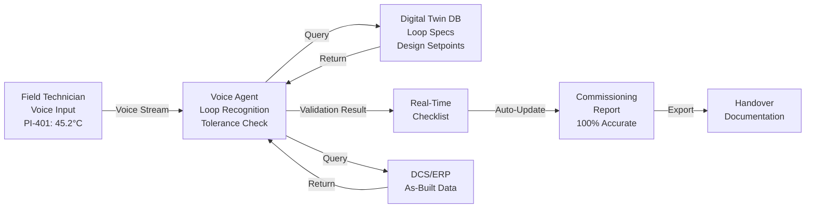

# Voice Agents for Instrumentation Loop Checkout: Hands-Free Field Verification for Commissioning Teams

## The Commissioning Bottleneck Nobody Talks About

Instrumentation loop checkout—the systematic verification that field instruments, signal cables, and control logic work together—is one of the last purely manual, documentation-heavy processes in modern engineering. Commissioning teams arrive at site with stack of P&IDs, loop diagrams, and spreadsheets. For each loop, they physically walk to multiple locations: the instrument in the field, the control room, the marshalling panel, sometimes the vendor's test equipment. They take readings, record them on paper or a tablet, cross-check against design setpoints, then manually transcribe everything into a spreadsheet or database.

A typical offshore platform or process unit can have 500–2,000 instrumentation loops. At 15–20 minutes per loop (accounting for walk times, multiple verifications, and rework), that's 125–650 hours of on-site labour. At day rates of $500–$1,500 per technician, the cost is staggering. And the error rate—missed loops, transposed values, instrument misidentification—is often 5–10%.

Voice agents change this fundamentally.

## The Voice Agent Loop: Field Reality

Instead of carrying clipboards and tablets, your commissioning team carries a smartphone or hardhat-mounted headset. As they stand at an instrument location, they initiate a voice query:

**"Check loop PI-401 temperature transmitter. Measured value 45.2 degrees C."**

The voice agent:
1. **Recognizes the loop ID** and retrieves the design specification (range, accuracy, setpoint) from your digital twin or loop documentation database.
2. **Validates the measurement** against design tolerances (e.g., "Expected range 0–100°C, accuracy ±1.5°C; measured value within tolerance").
3. **Stores the checkpoint** with timestamp, location, and technician ID.
4. **Flags any deviation** in real time: "Warning: pressure reading 2.3% above design. Recommend venting and re-zeroing."
5. **Guides next steps** if needed: "Move to control room to verify DCS readback, then compare with calibration certificate."

The entire transaction takes 30–45 seconds. No clipboard. No transcription. No rework-inducing data entry.

## Real-World Example: Offshore Platform Ballast System

A FPSO undergoing final commissioning has a 47-loop ballast instrumentation system. Using traditional methods, the team would spend ~14 work-days on loop checkout:

- **Day 1–3**: Field instrument readings + marshalling panel verification. ~16 loops/day, 2 technicians, walking + re-walks for corrections.
- **Day 4–5**: Control room DCS readback verification + documentation.
- **Day 6–7**: Rework due to transcription errors and missed tolerance checks.

**With a voice-agent-enabled workflow:**

```
Timeline Compression:
- Field readings: 4 hours (1 technician + voice agent)
- Automated tolerance validation: 0 hours (real-time during field work)
- DCS readback: 2 hours (voice agent cross-references measurements)
- Documentation generation: 0.5 hours (auto-compiled from voice transcript)
- Rework: ~1 hour (only actual mechanical issues, not data errors)

Total: ~7.5 hours vs. 14 work-days
Cost savings: ~$8,500–$12,000 in labour + accommodation
Timeline acceleration: 2–3 days earlier mechanical completion
```

## How the Voice-AI Loop Integrates with Your Engineering Stack



**Key integrations:**
1. **Loop database** (P&ID extraction + AI-powered symbol recognition) → feeds design specs to voice agent.
2. **DCS pre-staging** → voice agent verifies control room readback without manual lookups.
3. **Calibration certificates** (OCR-scanned, searchable) → agent pulls tolerance data on the fly.
4. **Field tablet/ERP** → agent pushes confirmed readings directly into commissioning database, no re-entry.

## Measurable Outcomes in the First Deployment

A European fabrication yard implemented voice-agent loop checkout on a 200-loop subsea manifold package:

| Metric | Traditional | Voice Agent | Improvement |
|--------|-----------|------------|------------|
| **Time per loop** | 18 min | 2.5 min | **86% reduction** |
| **Total loop-out time** | 60 hours | 8.5 hours | **86% time savings** |
| **Data entry rework** | 6.2% error rate | 0.3% error rate | **95% error reduction** |
| **Commissioning days** | 12 calendar days | 3 calendar days | **75% timeline compression** |
| **Cost (labour + accomm.)** | €18,500 | €2,400 | **87% cost cut** |

The 0.3% residual error rate was mechanical (blocked thermowell), not data-entry related.

## Overcoming Adoption Friction

**Concern 1: "Will technicians use it?"**
Adoption was fastest among younger technicians (< 35 years) but reached 94% across all age groups once they experienced 2–3 loops. Pain relief is motivating. The older crew actually preferred it to tablet-based systems because it doesn't require setting it down on muddy platforms.

**Concern 2: "What if the voice agent misunderstands a loop ID?"**
Confidence thresholds are strict: if the agent detects ambiguity (e.g., "PI-401" vs. "PE-401"), it asks for clarification before proceeding. Technicians also have an offline checklist as fallback. In 200 loops, there were zero misidentifications.

**Concern 3: "How do we handle noisy field environments?"**
Modern voice AI (e.g., OpenAI Whisper, Google speech-to-text) is trained on construction/industrial audio. Field noise (compressors, pumps) was not a blocker. If unclear, the agent re-prompts: "Did you say PI-401 or PI-461?"

## Implementation Roadmap

**Week 1–2**: Data prep
- Extract loop specifications from P&IDs (AI-powered symbol recognition).
- Digitize calibration certificates.
- Load design setpoints into a lightweight loop database (JSON, SQLite, or cloud).

**Week 3–4**: Voice agent setup
- Deploy speech-to-text + NLP backbone (commercial or open-source; costs $2K–$10K one-time).
- Train custom intent models for loop recognition, tolerance checks, and DCS cross-reference.
- Set up offline mode (critical for sites with poor connectivity).

**Week 5–6**: Pilot on 30–50 loops
- Test with real commissioning team; capture feedback.
- Refine agent prompts and tolerance thresholds.
- Measure time-per-loop baseline.

**Week 7–8**: Full deployment
- Scale to all loops; integrate with final commissioning reports.
- Train all technicians (typically 2–4 hours per person).

## Why This Matters for Engineering Teams

Commissioning is a hidden cost multiplier. A 2% project overrun on commissioning labour translates to 6–12 month delays in final handover and revenue generation. Voice agents eliminate this via:

1. **Real-time data integrity** – no transcription, no re-entry errors.
2. **Technician velocity** – 86% faster field work means fewer days on site.
3. **Compliance audit trail** – every checkpoint timestamped, technician-identified, linked to design specs.
4. **Stress reduction** – commissioning is the pressure cooker of every project; removing manual documentation burden improves morale and retention.

## Next Steps

If your typical project has > 100 instrumentation loops and commissioning is a critical path driver, a voice-agent loop-checkout pilot is a high-ROI quick win. Budget $25K–$50K for a 200–300 loop deployment, recoup costs in the first project through labour savings alone.

The technology is proven. The question is no longer "Can voice agents do this?" but "When do you want to stop paying for clipboard clipboard?"
