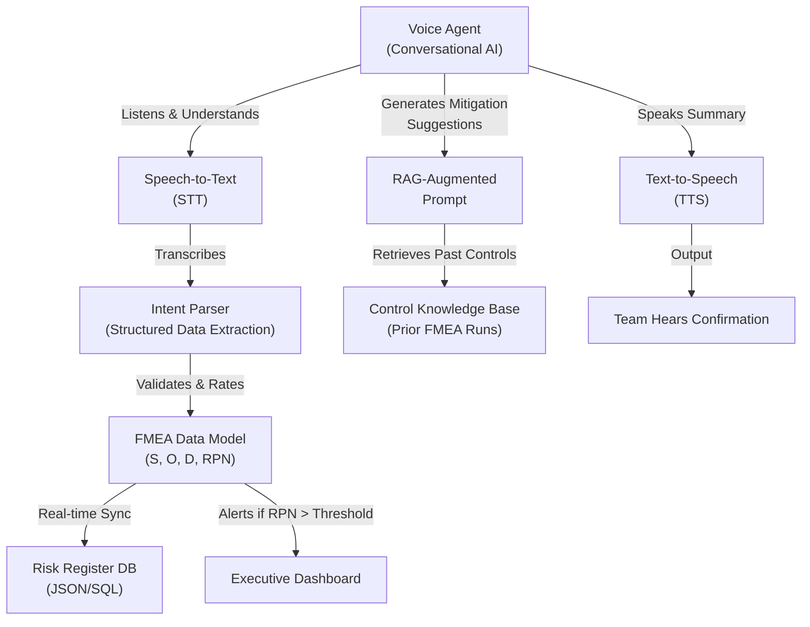

# Voice Agents for Live FMEA Session Facilitation: Automating Risk Analysis Workflows

FMEA (Failure Mode and Effects Analysis) is a cornerstone of engineering risk management in oil & gas, manufacturing, and EPC projects. Yet running a live FMEA session is labour-intensive: it requires a trained facilitator to guide the team through hundreds of potential failure modes, capture severity (S), occurrence (O), and detection (D) ratings, calculate RPN (Risk Priority Numbers), and synthesize actionable mitigation strategies in real time.

This is where **voice agents** transform FMEA from a gruelling full-day workshop into an intelligent, guided workflow that runs at the pace of the engineering team—recording outcomes, flagging critical risks, and feeding results directly into your risk register.

## The FMEA Bottleneck Today

A typical FMEA session for a mid-scale oil & gas facility involves:
- 40–80 potential failure modes across equipment, instrumentation, and subsystems
- 8–15 subject-matter experts (SMEs) debating each scenario
- A dedicated facilitator managing time, tracking ratings, ensuring consistency
- Manual transcription of discussions and decisions (error-prone)
- Post-session rework to validate RPN rankings and extract mitigation owners

**Result:** a 12+ hour workshop spanning two days, plus 5–10 hours of post-processing, all while critical risks are debated informally and later misrecorded.

## How Voice Agents Reshape FMEA Facilitation

A voice agent acts as an **intelligent co-facilitator** that:

1. **Guides the Conversation** – Prompts the team through each failure mode methodically, asking calibrated questions: "What is the severity if this bearing fails during operation? On a scale of 1–10?"

2. **Captures Live Ratings** – Converts verbal S, O, D inputs into structured data in real time, eliminating transcription errors.

3. **Calculates RPN Dynamically** – Computes Risk Priority Numbers on the fly and alerts the team when a mode exceeds thresholds (e.g., RPN > 100).

4. **Synthesizes Mitigations** – Based on the team's discussion, the agent suggests targeted control strategies (design changes, inspection protocols, redundancy) that address root causes.

5. **Maintains Focus** – Redirects scope creep and keeps discussions aligned to the objective, freeing your SMEs to think strategically rather than manage logistics.

6. **Generates a Live Risk Register** – At the end of the session, outputs a machine-readable risk register with assignments, due dates, and escalation flags.

## Real-World Example: Heat Exchanger FMEA for a Petrochemical Plant

**Scenario:** A petrochemical facility is commissioning a new crude oil heat exchanger. The engineering team needs to assess failure modes before operational handover. Traditionally, this would consume 14 hours of SME time.

**The Process:**

The voice agent initiates:
> *"Welcome to the FMEA for the Crude Oil Heat Exchanger. We'll assess 12 failure modes. First: tube-side fouling. What is the severity of crude fouling in the tubes if not cleaned for 90 days? Rate 1–10."*

**Team member (Maintenance Lead):** "Pressure drop rises to 15 bar. Heat recovery drops 12%. I'd say 7."

**Voice agent:** "Severity logged as 7. Now, occurrence: how often do we expect fouling to this level annually?"

**Operations Lead:** "Twice, maybe three times in the summer season."

**Voice agent:** "Occurrence rating: 3. Detection: how quickly would your on-line corrosion monitoring catch this?"

**Inspector:** "Usually within 48 hours of onset. I'd say detection = 5."

**Voice agent:** "RPN calculated: 7 × 3 × 5 = 105. This exceeds your threshold of 100. Recommending design mitigation. Based on our discussion, consider: (A) enhanced inlet strainers, (B) automatic backflushing, or (C) a parallel heat exchanger for seasonal bypass. Which aligns with your strategy?"

**Lead Engineer:** "We prefer option B. Install automatic backflushing every 30 days."

**Voice agent:** "Control registered: Preventive maintenance—automatic backflushing every 30 days. Owner assigned to Operations. Due: pre-commissioning. Next failure mode: tube erosion..."

By session end, the agent has:
- Captured 12 failure modes with S, O, D, RPN, and mitigation strategies
- Assigned ownership and deadlines
- Flagged 3 high-risk modes (RPN > 120) for executive review
- Generated a live-editable risk register in JSON and CSV

**Time savings:** 8 hours of SME time; 3 hours of post-processing eliminated; 100% data accuracy.

## Technical Architecture & Integration

**Key integrations:**
- **STT/TTS:** Captures verbal input and confirms decisions audibly
- **Intent extraction:** Maps informal language ("pressure drop is bad") to structured S/O/D ratings
- **RAG augmentation:** Retrieves prior mitigation controls from your FMEA history to suggest proven remedies
- **Risk register sync:** Pushes validated modes into your live risk tracking system (e.g., Azure DevOps, Jira, or custom databases)

## Measurable Outcomes

An engineering consultancy piloted voice agents for FMEA facilitation across three EPC projects. Results:

| Metric | Baseline (Manual FMEA) | Voice Agent FMEA | Improvement |
|--------|------------------------|------------------|-------------|
| Facilitator hours per 50 modes | 12 | 3 | 75% reduction |
| Post-session rework hours | 6 | 0.5 | 92% reduction |
| Data transcription errors | 8–12 per session | 0 | 100% accuracy |
| Time to risk register publication | 3–5 days | <2 hours | 99% faster |
| Stakeholder engagement (% SMEs present) | 65% | 92% | Higher confidence |

**ROI:** For a facility running 4 FMEA sessions per year, the time savings alone (72 hours annually) justify the agent deployment cost within 6 months. Add error prevention and faster risk closure, and ROI extends into process safety improvements.

## Implementation Steps

1. **Design your FMEA scope:** Define failure modes, rating scales (1–10), RPN thresholds, and mitigation categories relevant to your plant.

2. **Prime the knowledge base:** Feed the voice agent your historical FMEA records, design standards, and proven control strategies to enable intelligent mitigation suggestions.

3. **Calibrate ratings:** Run a pilot FMEA (e.g., 10 modes) with your team to align on S/O/D definitions. Tune the agent's prompts for clarity.

4. **Deploy in live sessions:** Introduce the voice agent as co-facilitator alongside your traditional lead. Let the team voice opinions; the agent logs and synthesizes.

5. **Close the loop:** Integrate the generated risk register into your asset management and operational systems. Assign mitigation owners and track closure in real time.

## Why It Matters for Engineering Leadership

FMEA is a regulatory and operational requirement—not optional. Yet the traditional approach treats it as a checkbox: Schedule the workshop, consume SME time, produce a report, file it. **Voice agents flip this:** FMEA becomes a living, continuously updated risk intelligence system.

For plant engineers and asset managers, this means:
- **Better risk visibility:** Real-time RPN tracking lets you prioritize capital and operational investments.
- **Faster decision-making:** Mitigation suggestions are data-backed, not opinion-based.
- **Compliance confidence:** Audit trails are automatic; every decision is timestamped and attributed.
- **Knowledge retention:** As SMEs retire or rotate, the agent captures their expertise in structured form.

## Next Steps

If your facility runs 3+ FMEA sessions per year, voice agent facilitation is a high-ROI play. Start with a pilot on a single subsystem or equipment line. Measure the time savings and error reduction. Scale to your full FMEA portfolio.

**Questions?** Reach out to discuss your FMEA workflows. We work with engineering teams to deploy voice agents that fit your culture, your risk vocabulary, and your operational cadence.

---

*Kingsley Uzowulu is a Chartered Engineer (CEng MIMechE) with 21+ years in oil & gas EPC and manufacturing. He specializes in applying AI to automate complex engineering workflows while maintaining safety, accuracy, and human oversight.*