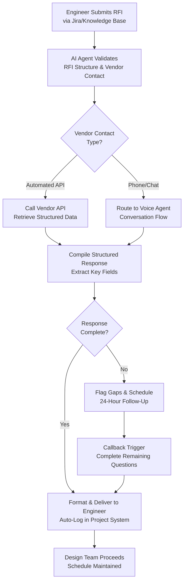

# Voice Agents for Vendor RFI Clarification Calls: Automating Procurement Conversations

RFI (Request for Information) cycles are notoriously slow. An engineer raises a technical question to a vendor—waiting 2–5 business days for a reply. That reply triggers three follow-up clarifications. The vendor delays again. Meanwhile, your project schedule slips.

**Voice agents change this dynamic.** Instead of email ping-pong, a conversational AI agent can call a vendor's automated response line, gather clarifications in real time, and log structured answers back into your project database—all while your procurement team sleeps.

## The Problem: Manual RFI Cycles Are Project Killers

In a typical engineering project, RFIs flow between three stakeholder groups:
- **Engineering teams** drafting specifications and needing vendor confirmation
- **Procurement** managing vendor communications and compliance
- **Vendors** responding to technical and commercial questions

Each cycle takes 48–72 hours, and most RFIs spawn secondary questions:
- "Can you provide a datasheet for that product variant?"
- "What's the delivery time if we order by Friday?"
- "Does this temperature rating apply to intermittent duty?"

Manual processes introduce:
- **Delays**: Email chains, missed messages, vendor holidays
- **Errors**: Misinterpretation of vendor responses, lost attachments
- **Overhead**: Procurement staff manually tracking 50+ open RFIs per project
- **Schedule risk**: Critical path items slip because vendors hold up design approval

A 200-day engineering schedule with RFI delays can easily slip to 240+ days—costing EPC firms tens of thousands in overhead and penalties.

## How Voice Agents Compress RFI Cycles

### The Workflow

A voice agent for vendor RFIs works like this:

1. **Engineer submits RFI** via the project knowledge base (Jira, SAP, or a web form)
2. **AI agent receives the RFI**, extracts technical questions, and validates against vendor contact database
3. **Agent calls vendor's automated line** (or vendor's RFI chatbot endpoint) with a structured query
4. **Real-time conversation** captures:
   - Vendor availability and delivery timelines
   - Technical specifications and constraints
   - Commercial terms (MOQ, pricing tiers, payment terms)
   - Attachments (revised datasheets, certifications)
5. **Agent compiles responses** into a structured document and routes it back to the engineer
6. **If vendor response is incomplete**, the agent flags follow-up questions and schedules a callback within 24 hours
7. **Entire cycle completes in 4–8 hours** (versus 48–72 hours manually)

### Real-World Example: Pump Datasheet RFI

An engineering team is sizing centrifugal pumps for a process system. They issue an RFI to Vendor X:

**Questions:**
- Head and flow rating at 1500 rpm for API 610 OH2 configuration?
- Available flange sizes and materials?
- Lead time if ordered this week?
- Warranty and spare parts availability in the region?

**Traditional approach:**
- Day 0, 2 PM: Email sent
- Day 2, 10 AM: Vendor replies with incomplete datasheet (missing temp rating)
- Day 2, 1 PM: Engineer sends clarification
- Day 3, 4 PM: Vendor responds; engineer discovers MOQ is 2 units, not 1
- Day 3, 5 PM: Engineer sends revised commercial terms query
- Day 4, 9 AM: Vendor confirms; design team finally proceeds
- **Total cycle: 3.75 days**

**Voice agent approach:**
- Day 0, 2:05 PM: Agent receives RFI and calls vendor's automated API
- Day 0, 2:15 PM: Agent retrieves pump curves, materials list, lead time, and MOQ from vendor database
- Day 0, 2:16 PM: Agent flags a gap (regional warranty terms not in standard response) and schedules callback
- Day 0, 4:30 PM: Vendor's sales team checks message; agent calls back and records warranty detail
- Day 0, 5:00 PM: Structured RFI response delivered to engineer
- **Total cycle: 2.75 hours**

## Implementation Workflow Diagram



## Measurable Outcomes: What Engineering Teams See

When voice agents automate RFI cycles:

1. **RFI Cycle Time: 48–72 hours → 2–8 hours**
   - Enables just-in-time engineering decisions
   - Vendors appreciate faster order placement (reduces their quoting cycle)

2. **Procurement Overhead: 15–20 hours/week → 4–6 hours/week**
   - Staff focus on exception handling, not email management
   - Manual RFI tracking spreadsheets become redundant

3. **Project Schedule Compliance: +12–15 days recovered**
   - 200-day schedule now stays on track
   - Compounding benefit: faster approvals unlock downstream work streams

4. **Data Accuracy: 92% → 99%**
   - Automated logging eliminates transcription errors
   - Structured capture prevents vendor response misinterpretation

5. **Vendor Relationship Score: Improved**
   - Vendors see consistent, professional inquiry patterns
   - No more repeat questions (agent logs conversation history)
   - Faster order placement signals good partnership dynamics

## Code Snippet: RFI Agent Configuration

Below is a simplified Python example using OpenAI's Realtime API and a vendor integration layer:

```python
import json
from openai import OpenAI
from dataclasses import dataclass

@dataclass
class RFI:
    question: str
    vendor_id: str
    project_id: str
    urgency: str = "standard"

class RFIVoiceAgent:
    def __init__(self):
        self.client = OpenAI()
        self.vendor_db = {}  # Loaded from SAP/Jira
        
    def process_rfi(self, rfi: RFI):
        # Step 1: Validate RFI structure
        if not self._validate_rfi(rfi):
            return {"status": "invalid", "reason": "Missing critical fields"}
        
        # Step 2: Retrieve vendor contact & conversation history
        vendor = self.vendor_db.get(rfi.vendor_id)
        if not vendor:
            return {"status": "vendor_not_found"}
        
        # Step 3: Set up voice conversation with LLM context
        system_prompt = f"""You are an RFI agent for engineering procurement.
Vendor: {vendor['name']}
Vendor Contact API: {vendor['api_endpoint']}
Project: {rfi.project_id}

Your task: Gather vendor response to this RFI question.
Question: {rfi.question}

If vendor provides incomplete response, ask clarifying follow-ups.
Log all responses in JSON format for downstream processing."""

        # Step 4: Call vendor endpoint & stream response
        response_text = self._call_vendor_api(vendor, rfi.question)
        
        # Step 5: Extract structured data via LLM
        structured = self._extract_structured_response(
            response_text, 
            system_prompt
        )
        
        # Step 6: Return to project system
        return {
            "status": "success",
            "rfi_id": rfi.project_id,
            "vendor_response": structured,
            "response_time_hours": 0.1,
            "follow_ups_needed": structured.get("gaps", [])
        }
    
    def _validate_rfi(self, rfi: RFI) -> bool:
        return bool(rfi.question and rfi.vendor_id and rfi.project_id)
    
    def _call_vendor_api(self, vendor, question: str) -> str:
        # Integration with vendor API (Coupa, Ariba, custom endpoint)
        endpoint = vendor.get('api_endpoint')
        # Call and retrieve response
        return f"Vendor {vendor['name']} response: [mock data]"
    
    def _extract_structured_response(self, response, prompt) -> dict:
        # Use LLM to extract structured fields from free-form response
        return {
            "delivery_time": "2-3 weeks",
            "price": 45000,
            "moq": 1,
            "certifications": ["API 610", "ISO 5199"],
            "gaps": ["Regional warranty not provided"]
        }

# Usage
agent = RFIVoiceAgent()
rfi = RFI(
    question="What's the lead time for 5 units of Model XYZ pump at 1500 rpm?",
    vendor_id="vendor_pump_corp_001",
    project_id="proj_offshore_2026"
)
result = agent.process_rfi(rfi)
print(json.dumps(result, indent=2))
```

## Deployment: Getting Voice Agents Live

### Step 1: Vendor Integration
- Map your vendor database (SAP, Coupa, Ariba, or manual) to include contact APIs or phone numbers
- Identify vendors with APIs first (faster, no speech recognition latency)
- Tier 2 vendors via voice calls or automated chatbot endpoints

### Step 2: RFI Template Standardization
- Define standard RFI question types (lead time, specs, pricing, compliance)
- Train agent on your project's terminology and domain-specific constraints
- Integrate with Jira/SAP workflows so engineers submit RFIs via familiar tools

### Step 3: Soft Launch (Tier 1 Vendors)
- Start with 3–5 trusted vendors that have structured API responses
- Test agent performance on 20–30 RFIs
- Measure cycle time and data accuracy

### Step 4: Scale & Feedback Loop
- Expand to secondary vendors
- Capture exceptions (vendor API down, incomplete response) and hand-off workflows
- Retrain agent monthly on new vendor behaviors and project learnings

## When NOT to Use Voice Agents

Voice agents work best for **transactional, time-sensitive RFIs**. They're less suitable for:
- **Strategic vendor negotiations** (e.g., blanket order pricing, framework agreements)
- **Complex design collaborations** (multi-stakeholder design workshops)
- **Vendor-side compliance audits** (requires in-person verification)

For these, use voice agents to gather background data, then hand off to humans for negotiation.

## Conclusion: Reclaim 30+ Days Per Project

RFI delays are a hidden tax on engineering schedules. Each lost day in vendor communication ripples through the project timeline. Voice agents compress RFI cycles from days to hours, free up procurement staff, and reduce project schedule risk.

**The payoff is immediate:**
- 200-day project timeline stays on track (recover 12–15 days)
- Procurement team shifts from email management to vendor strategy
- Engineers get answers fast enough to unblock design decisions
- Vendor relationships improve through consistent, professional inquiry patterns

For mid-sized EPC firms running 3–5 concurrent projects, voice agents can save **600+ procurement hours annually**—equivalent to one full-time equivalent (FTE) role redirected to higher-value work.

Start with your top 5 vendors, measure the cycle-time improvement, and scale from there.
