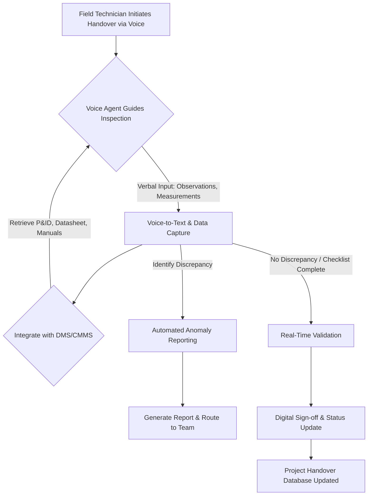

## Introduction: The Critical Role of Equipment Handover in Engineering Projects

In large-scale engineering projects, particularly within sectors like oil & gas, manufacturing, and infrastructure, the handover of equipment and systems from construction to operations is a critical phase. This process, often complex and document-heavy, ensures that all assets are properly installed, tested, certified, and ready for safe and efficient operation. A flawed handover can lead to significant delays, operational inefficiencies, increased maintenance costs, and even safety incidents.

Traditionally, equipment handover involves extensive manual checks, paper-based forms, and a labyrinth of documentation. Field engineers and technicians spend countless hours physically inspecting assets, cross-referencing datasheets, P&IDs, vendor manuals, and maintenance logs. This labor-intensive process is prone to human error, inconsistencies, and bottlenecks, especially when dealing with hundreds or thousands of pieces of equipment across vast project sites.

Enter AI voice agents—a transformative technology poised to revolutionize how engineering teams manage equipment handover. By leveraging natural language processing (NLP), speech-to-text, and intelligent automation, voice agents can streamline checklist navigation, data capture, and anomaly reporting, ultimately accelerating project closeouts and enhancing operational readiness.

## The Challenges of Traditional Equipment Handover

Before diving into the AI solution, it’s essential to understand the inherent challenges of conventional equipment handover:

1.  **Manual Data Entry and Documentation:** Technicians often fill out forms manually, leading to illegible handwriting, data entry errors, and time-consuming transcription into digital systems.
2.  **Dispersed Information:** Critical information (e.g., design specifications, maintenance history, certification records) is often scattered across multiple systems, databases, and physical documents, making quick verification difficult.
3.  **Inconsistent Checklists:** Without standardized digital workflows, different teams or projects might use varying handover checklists, leading to inconsistent data quality and potential oversight.
4.  **Time-Consuming Verification:** Verifying each asset against its extensive documentation requires significant time and effort, delaying the transition to operational phases.
5.  **Delayed Anomaly Reporting:** Identifying and reporting discrepancies or defects during handover can be slow, involving multiple communication channels and manual tracking, which exacerbates delays.
6.  **Training and Competency:** Ensuring that all personnel involved in handover are consistently trained on procedures and documentation standards is a continuous challenge.

These challenges collectively contribute to project overruns and increased operational risks. The goal of automating this process with AI voice agents is to mitigate these issues, making handover more efficient, accurate, and transparent.

## How AI Voice Agents Transform Equipment Handover

AI voice agents act as intelligent digital assistants, guiding field personnel through complex handover procedures using natural language. They enable hands-free interaction, allowing technicians to focus on physical inspection while simultaneously capturing data and reporting findings.

Here’s a breakdown of their capabilities:

1.  **Guided Checklist Navigation:** Voice agents can lead technicians step-by-step through digital handover checklists, prompting for specific observations and actions. This ensures consistency and thoroughness.
2.  **Hands-Free Data Capture:** Technicians can verbally report observations, measurements, and status updates, which the voice agent instantly transcribes and logs into a centralized system. This eliminates manual data entry and reduces errors.
3.  **Real-Time Documentation Access:** By integrating with existing knowledge bases and document management systems (DMS), voice agents can provide instant access to relevant P&IDs, datasheets, vendor manuals, and maintenance histories upon verbal request.
4.  **Automated Anomaly Reporting:** When a discrepancy or anomaly is identified, the technician can describe it verbally. The voice agent automatically generates a report, categorizes the issue, attaches relevant context (e.g., equipment ID, location), and routes it to the appropriate team for resolution.
5.  **Intelligent Verification:** Voice agents can perform real-time checks against pre-defined rules or linked documentation. For instance, if a technician reports a pressure reading, the agent can cross-reference it with the design pressure range in the datasheet and flag any deviations.
6.  **Multilingual Support:** For global projects, voice agents can provide instructions and capture data in multiple languages, overcoming communication barriers and improving team efficiency.

## Real-World Example: Automating Valve Handover on an Offshore Platform

Consider an offshore oil and gas platform with thousands of valves requiring handover. Traditionally, this involves a team of technicians spending weeks or months physically locating each valve, verifying its installation, checking tag numbers, confirming actuator operation, and comparing against P&IDs and datasheets.

**Scenario with AI Voice Agent:**

1.  **Initiation:** A field technician, equipped with a voice-enabled device (e.g., a rugged tablet with a headset), approaches a valve. They verbally identify the valve tag number, "Start handover for tag VLV-101-005."
2.  **Guided Inspection:** The voice agent, linked to the project's digital twin and document management system, retrieves the specific checklist for VLV-101-005.
    *   **Agent:** "VLV-101-005. Confirm physical installation status: installed, not installed, or partially installed?"
    *   **Technician:** "Installed."
    *   **Agent:** "Confirm tag plate matches P&ID: VLV-101-005?"
    *   **Technician:** "Matches."
    *   **Agent:** "Actuator type and size match datasheet?"
    *   **Technician:** "Yes, pneumatic actuator, 12-inch, matches datasheet." (The agent cross-references the verbal input with the digital datasheet.)
    *   **Agent:** "Perform visual inspection for leaks or damage. Any observations?"
    *   **Technician:** "Minor corrosion on the stem, not affecting operation. Recommend a touch-up during next shutdown."
3.  **Automated Reporting:** The agent instantly logs "Minor corrosion on stem" as an observation, noting the valve tag, technician ID, and timestamp. It can even suggest a severity level and automatically open a minor maintenance ticket in the CMMS (Computerized Maintenance Management System).
4.  **Verification and Sign-off:** Once all checklist items are complete, the agent prompts for final verbal confirmation. The technician confirms, and the system records a digital sign-off, updating the valve's handover status to "Complete" in the project database.

This process significantly reduces manual effort, ensures data consistency, and provides real-time visibility into handover progress and outstanding issues.

### Measurable Outcome

**Reduced Handover Time by 30%:** In a pilot project implementing voice agents for valve handover, a major EPC firm reduced the average time per valve handover from 45 minutes to 30 minutes, representing a 33% efficiency gain. Over a project with 5,000 valves, this translated to a saving of approximately 1,250 labor hours, accelerating project closeout by several weeks.

**Error Rate Reduction of 25%:** Manual data entry errors, misinterpretations of specifications, and overlooked checklist items were reduced by 25% due to guided workflows and real-time validation capabilities of the voice agent.

## Workflow Diagram: Voice-Enabled Equipment Handover

Here's a simplified Mermaid diagram illustrating the workflow:

## Implementing AI Voice Agents: Key Considerations

Successfully deploying AI voice agents for equipment handover requires careful planning and execution:

1.  **Integration with Existing Systems:** The voice agent solution must seamlessly integrate with your current Document Management Systems (DMS), Computerized Maintenance Management Systems (CMMS), Enterprise Resource Planning (ERP), and digital twin platforms. APIs and robust data connectors are crucial.
2.  **Customization of Checklists and Knowledge Base:** The agent's knowledge base and checklists need to be tailored to specific equipment types, project requirements, and industry standards. This involves training the AI on project-specific terminology and documentation.
3.  **Speech Recognition Accuracy:** In noisy industrial environments, speech-to-text accuracy is paramount. Investing in robust speech recognition technology, potentially with noise cancellation capabilities and domain-specific vocabulary training, is essential.
4.  **User Acceptance and Training:** Field personnel need adequate training to become comfortable interacting with voice agents. Highlighting the benefits (e.g., reduced paperwork, increased efficiency) can drive adoption.
5.  **Data Security and Privacy:** Ensure that all data captured and processed by voice agents complies with relevant data security, privacy regulations, and company policies.
6.  **Offline Capability:** For remote sites with limited connectivity, the voice agent solution should offer offline capabilities, syncing data once connectivity is restored.

## The Future of Handover: Beyond Automation

While automating individual handover procedures is a significant step, the future holds even greater promise. Multi-agent systems could take this further:

*   **Autonomous Verification Agents:** One voice agent guides the technician, while a separate "verification agent" independently reviews captured data against design specifications and flag potential compliance issues proactively.
*   **Predictive Handover Readiness:** AI could analyze project schedules, documentation completion rates, and historical handover data to predict potential bottlenecks and suggest interventions before they occur.
*   **Knowledge Graph Integration:** Integrating voice agents with sophisticated knowledge graphs would allow for richer, more contextual understanding of equipment relationships and operational interdependencies, enabling deeper insights and faster problem resolution during handover.

## Conclusion

AI voice agents are poised to fundamentally reshape equipment handover procedures in engineering projects. By automating data capture, guiding inspections, providing real-time information, and streamlining anomaly reporting, they offer a tangible path to reducing errors, accelerating project closeouts, and significantly enhancing operational efficiency. For engineering firms grappling with complex, time-sensitive handovers, embracing this technology isn't just about innovation—it's about achieving measurable gains in productivity, safety, and project certainty. The future of engineering handover is hands-free, intelligent, and driven by the power of voice AI.
